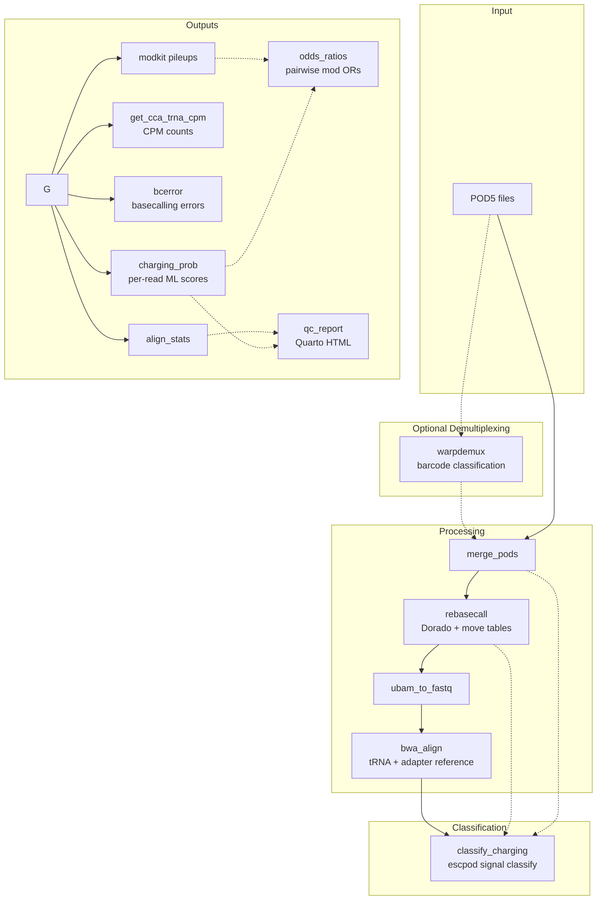

# aa-tRNA-seq-pipeline

[](https://github.com/rnabioco/aa-tRNA-seq-pipeline/actions/workflows/ci.yml)
[](https://github.com/rnabioco/aa-tRNA-seq-pipeline/actions/workflows/lint.yml)
[](https://rnabioco.github.io/aa-tRNA-seq-pipeline)

A Snakemake pipeline to process ONT aa-tRNA-seq data.

## Prerequisites

This pipeline uses [Pixi](https://pixi.sh) for environment management. Install it first:

```bash
curl -fsSL https://pixi.sh/install.sh | sh
```

See the [Pixi installation guide](https://pixi.prefix.dev/latest/installation/) for alternative methods (Homebrew, Windows, etc.).

## Usage

The pipeline can be configured by editing the `config/config.yml` file. The config file specifications will
run a small example dataset through the pipeline.

```bash
git clone https://github.com/rnabioco/aa-tRNA-seq-pipeline.git
cd aa-tRNA-seq-pipeline

# Install environment
pixi install

# One-time setup: download tools, models, and test data
pixi run setup
pixi run dl-test-data

# Dry run
pixi run dry-run

# Run pipeline locally with test data
pixi run test
```

## Configuration

To use on your own samples, create a config file and sample file in `config/`.

### Standard Usage (Non-Multiplexed Runs)

Create a TSV sample file with sample IDs and run paths:

```
sample1    /path/to/run1
sample2    /path/to/run2
```

Then create a config file pointing to it:

```yaml
samples: config/samples.tsv
output_directory: "results"
```

### Multiplexed Runs (WarpDemuX Demultiplexing)

For pooled sequencing runs with WarpDemuX barcodes, use a YAML sample file:

```yaml
runs:
  - path: /path/to/pooled/run
    barcode_kit: "WDX4_tRNA_rna004_v1_0"
    samples:
      charged_sample: "barcode03"
      uncharged_sample: "barcode04"
```

Enable demultiplexing in your config:

```yaml
samples: config/samples-demux.yml
output_directory: "results"

warpdemux:
    enabled: true
    barcode_kit: "WDX4_tRNA_rna004_v1_0"
```

Run with pixi: 

```bash
pixi run snakemake --configfile=config/config-demux.yml --cores 8
```

See [README.md in the config directory](https://github.com/rnabioco/aa-tRNA-seq-pipeline/tree/main/config) for additional details on all configuration options.

## Workflow



Given a directory of POD5 files, this pipeline:

1. **(Optional) Demultiplexes** pooled runs using WarpDemuX barcode classification
2. **Merges** all POD5 files per sample into a single file
3. **Rebasecalls** with Dorado to generate unmapped BAM with move tables (required by the charging model)
4. **Converts** BAM to FASTQ and **aligns** to tRNA + adapter reference with BWA MEM
5. **Filters** for full-length tRNA reads with proper adapter boundaries
6. **Classifies** charged vs. uncharged reads with `escpod signal classify`, against an ONNX model trained on nanopore signal over the CCA 3' end

The classification writes a `cl` tag (0-255) onto each scored read, `round(P(charged) * 255)`. By default `cl` >= 200 is charged and < 200 uncharged; this is the model bundle's own recommended operating point and is set by `charging.ml_threshold` in the config.

Reads the model **abstains** on carry no `cl` tag at all, rather than a default class. Abstention is charging-correlated, so a charging fraction computed over called reads alone is an underestimate — `summary/tables/{sample}/{sample}.charging_calls.tsv.gz` gives the per-read reason and `summary/read_attrition.tsv.gz` the run-level rate. Read them beside the fraction.

The final steps of the pipeline calculate a number of outputs that may be useful for analysis and visualization, including normalized counts for charged and uncharged tRNA (`get_cca_trna_cpm`), basecalling error values (`bcerror`), alignment statistics (`align_stats`), per-tRNA pairwise modification odds ratios (`compute_odds_ratios`), reference sequence similarity QC (`compute_reference_similarity`), and a combined Quarto QC report (`render_combined_qc_report`).

### Charging classification

A few notes about charged vs. uncharged tRNA read classification

1. this step retains only full length tRNA reads (with an allowance for signal loss at the 5´ end of nanopore direct RNA sequencing)
2. Additionally, due to the iterative nature of sequencing method development, the present approach does not rely on differences in adapter sequences attached to charged vs. uncharged tRNA molecules (though these sequences are retained as separate entries in the alignment reference and downstream files). While we anticipate being able to leverage this information in the future, the current pipeline relies exclusively on signal data over a 6-nt modification kmer spanning the universal CCA 3′ end of tRNA and the first three nucleotides of the 3′ adapter (CCAGGC) to distinguish charged and uncharged reads.

## Cluster execution

The pipeline includes cluster profiles for LSF and SLURM schedulers.

```bash
# Run test data on LSF cluster
pixi run test-lsf

# Run test data on SLURM cluster
pixi run test-slurm

# Run full preprint analysis on cluster
pixi run run-preprint
```

For more details on configuring HPC jobs, see `cluster/lsf/config.yaml` or `cluster/slurm/config.yaml`.

## Citation

To cite this work, see:

> White LK, Radakovic A, Sajek MP, Dobson K, Riemondy KA, Del Pozo S, Szostak JW, Hesselberth JR. Nanopore sequencing of intact aminoacylated tRNAs. Nat Commun. 2025 Aug 20;16(1):7781. doi: 10.1038/s41467-025-62545-9. PMID: 40835813; PMCID: PMC12368100.

