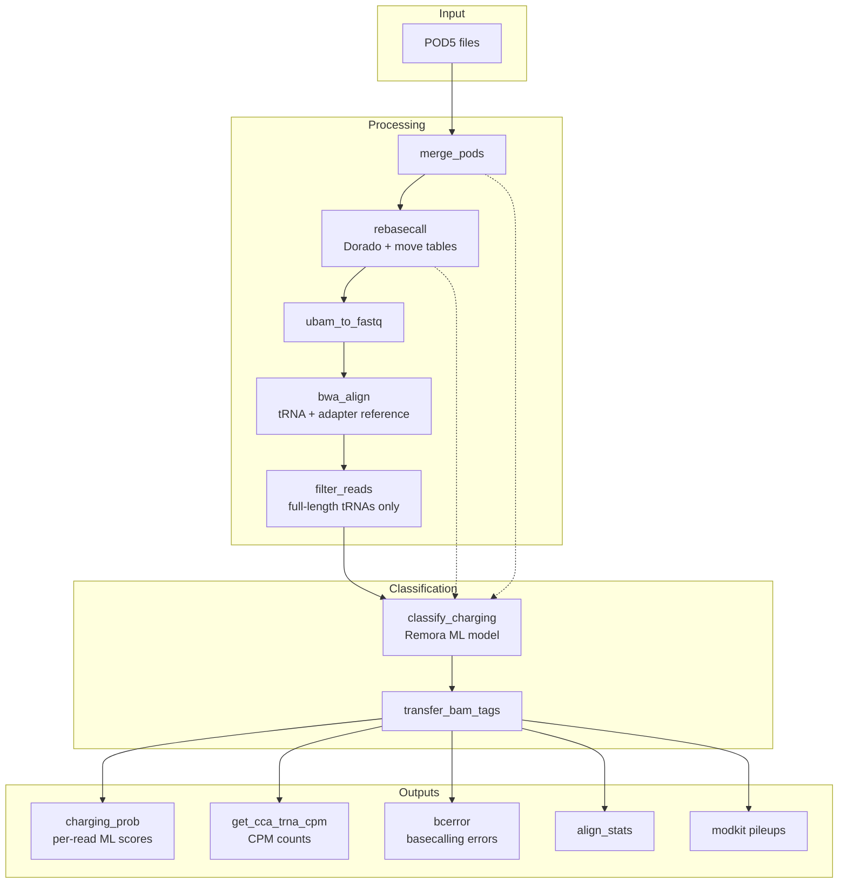

# aa-tRNA-seq-pipeline

[](https://github.com/rnabioco/aa-tRNA-seq-pipeline/actions/workflows/ci.yml)
[](https://github.com/rnabioco/aa-tRNA-seq-pipeline/actions/workflows/lint.yml)

A Snakemake pipeline to process ONT aa-tRNA-seq data.

Downstream analysis to generate figures for the initial preprint can be found at: [https://github.com/rnabioco/aa-tRNA-seq](https://github.com/rnabioco/aa-tRNA-seq)

## Usage

The pipeline can be configured by editing the `config/config.yml` file. The config file specifications will
run a small example dataset through the pipeline. To download these data files:

```
git clone https://github.com/rnabioco/aa-tRNA-seq-pipeline.git

# download test data
bash .test/dl_data.sh
```

Set up a conda environment:

```bash
mamba env create -f workflow/envs/aatrnaseqpipe-env.yml
mamba activate aatrnaseqpipe
```

Set up the dorado and modkit resources. This will install the tools in the `resources/tools` directory,
so only need to be done once during the first run of the pipeline.

```
snakemake setup_dorado dorado_model setup_modkit
```

Test the pipeline by invoking a dry-run snakemake in the pipeline root directory:

```
snakemake -n --configfile=config/config-test.yml
```

## Configuration

To use on your own samples, edit `config.yml` and `samples.tsv`  in  `config/`.

See [README.md in the config directory](https://github.com/rnabioco/aa-tRNA-seq-pipeline/tree/main/config) for additional details.

## Workflow



Given a directory of POD5 files, this pipeline:

1. **Merges** all POD5 files per sample into a single file
2. **Rebasecalls** with Dorado to generate unmapped BAM with move tables (required for Remora)
3. **Converts** BAM to FASTQ and **aligns** to tRNA + adapter reference with BWA MEM
4. **Filters** for full-length tRNA reads with proper adapter boundaries
5. **Classifies** charged vs. uncharged reads using a Remora model trained on nanopore signal over the CCA 3' end

The classification generates ML tag values (0-255) indicating the likelihood of aminoacylation. By default, ML values of 200-255 are treated as charged, and values <200 as uncharged. This threshold can be adjusted via the `ml-threshold` parameter in the `get_cca_trna_cpm` rule.

The final steps of the pipeline calculate a number of outputs that may be useful for analysis and visualization, including normalized counts for charged and uncharged tRNA (`get_cca_trna_cpm`), basecalling error values (`bcerror`), alignment statistics (`align_stats`) and information on raw nanopore signal from Remora (`remora_signal_stats`).

### Remora classification

A few notes about Remora classification for charged vs. uncharged tRNA reads

1. this step retains only full length tRNA reads (with an allowance for signal loss at the 5´ end of nanopore direct RNA sequencing)
2. Additionally, due to the iterative nature of sequencing method development, the present approach does not rely on differences in adapter sequences attached to charged vs. uncharged tRNA molecules (though these sequences are retained as separate entries in the alignment reference and downstream files). While we anticipate being able to leverage this information in the future, the current pipeline relies exclusively on signal data over a 6-nt modification kmer spanning the universal CCA 3′ end of tRNA and the first three nucleotides of the 3′ adapter (CCAGGC) to distinguish charged and uncharged reads.

## Cluster execution

The pipeline includes a `run.sh` script optimized for the LSF scheduler. For more details on configuring for HPC jobs, see `cluster/config.yaml`.
