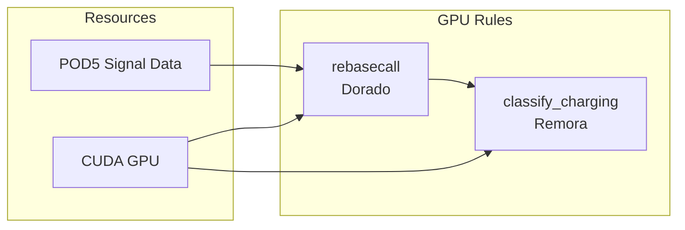

# GPU Configuration

Configure GPU resources for the aa-tRNA-seq pipeline.

## GPU Requirements

Two rules require GPU access:

| Rule | Purpose | GPU Usage |
|------|---------|-----------|
| `rebasecall` | Dorado basecalling | CUDA neural network inference |
| `classify_charging` | Remora classification | PyTorch model inference |

Both rules benefit significantly from GPU acceleration. CPU-only execution is possible but substantially slower.

## GPU Resource Flow



## Cluster Configuration

### LSF GPU Settings

In `cluster/lsf/config.yaml`:

```yaml
# Limit total concurrent GPU jobs
resources:
  - ngpu=12

# GPU rule configuration
set-resources:
  - rebasecall:lsf_queue="gpu"
  - rebasecall:lsf_extra="-gpu num=1:j_exclusive=yes"
  - rebasecall:ngpu=1
  - rebasecall:mem_mb=24

  - classify_charging:lsf_queue="gpu"
  - classify_charging:lsf_extra="-gpu num=1:j_exclusive=yes"
  - classify_charging:ngpu=1
  - classify_charging:mem_mb=24
```

### SLURM GPU Settings

```yaml
resources:
  - ngpu=8

set-resources:
  - rebasecall:partition="gpu"
  - rebasecall:gpu_opts="--gres=gpu:1"
  - rebasecall:ngpu=1
  - rebasecall:mem_mb=24000

  - classify_charging:partition="gpu"
  - classify_charging:gpu_opts="--gres=gpu:1"
  - classify_charging:ngpu=1
  - classify_charging:mem_mb=24000
```

## Configuration Options

### GPU Concurrency Limit

Control how many GPU jobs run simultaneously:

```yaml
resources:
  - ngpu=8  # Max 8 concurrent GPU jobs
```

Set this to match your available GPUs or queue limits.

### CUDA Toolkit Version

The pipeline installs PyTorch with CUDA 12.4 support by default. To use a different CUDA version, set the `CUDA_VERSION` environment variable before activating the environment:

```bash
# For CUDA 11.8
export CUDA_VERSION=cu118
pixi shell

# For CUDA 12.1
export CUDA_VERSION=cu121
pixi shell

# For CPU-only (no CUDA)
export CUDA_VERSION=cpu
pixi shell
```

Available CUDA wheel tags: `cu118`, `cu121`, `cu124`, `cpu`

!!! tip "Check your CUDA version"
    Run `nvidia-smi` to see your installed CUDA driver version. Choose a PyTorch CUDA version that matches or is lower than your driver version.

### Exclusive GPU Access

Request exclusive GPU access to avoid memory conflicts:

=== "LSF"

    ```yaml
    set-resources:
      - rebasecall:lsf_extra="-gpu num=1:j_exclusive=yes"
    ```

=== "SLURM"

    ```yaml
    set-resources:
      - rebasecall:gpu_opts="--gres=gpu:1 --exclusive"
    ```

### GPU Type Selection

If your cluster has multiple GPU types:

=== "LSF"

    ```yaml
    set-resources:
      - rebasecall:lsf_extra="-gpu num=1:j_exclusive=yes:gtile='!gv100'"
    ```

=== "SLURM"

    ```yaml
    set-resources:
      - rebasecall:gpu_opts="--gres=gpu:v100:1"
    ```

## Local GPU Execution

### CUDA_VISIBLE_DEVICES

The pipeline respects `CUDA_VISIBLE_DEVICES`:

```bash
# Use specific GPU
export CUDA_VISIBLE_DEVICES=0
pixi run snakemake --cores 4 --configfile=config/config.yml

# Use multiple GPUs (one per job)
export CUDA_VISIBLE_DEVICES=0,1
pixi run snakemake --cores 4 --resources gpu=2 --configfile=config/config.yml
```

### Limit GPU Jobs Locally

```bash
pixi run snakemake --cores 8 --resources gpu=1 \
    --configfile=config/config.yml
```

## Memory Requirements

GPU rules also require significant system memory:

| Rule | GPU Memory | System Memory |
|------|------------|---------------|
| `rebasecall` | ~8-16 GB | 24 GB |
| `classify_charging` | ~4-8 GB | 24 GB |

## Performance Considerations

### Dorado (rebasecall)

- Processes POD5 signal data through neural network
- Throughput: ~100-500 reads/second depending on GPU
- Benefits from newer GPU architectures (Ampere, Ada Lovelace)

### Remora (classify_charging)

- Analyzes signal at CCA 3' end
- Lower throughput than Dorado
- Memory usage depends on batch size

## Troubleshooting

### CUDA Out of Memory

**Symptom:**
```
RuntimeError: CUDA out of memory
```

**Solutions:**

1. Ensure exclusive GPU access:
   ```yaml
   set-resources:
     - rebasecall:lsf_extra="-gpu num=1:j_exclusive=yes"
   ```

2. Reduce concurrent GPU jobs:
   ```yaml
   resources:
     - ngpu=4  # Reduce from default
   ```

3. Check for other GPU processes:
   ```bash
   nvidia-smi
   ```

### GPU Not Detected

**Symptom:**
```
No CUDA GPUs are available
```

**Solutions:**

1. Verify CUDA installation:
   ```bash
   nvidia-smi
   ```

2. Check CUDA_VISIBLE_DEVICES:
   ```bash
   echo $CUDA_VISIBLE_DEVICES
   ```

3. Verify job is on GPU node:
   ```bash
   # LSF
   bjobs -l <job_id> | grep -i gpu

   # SLURM
   scontrol show job <job_id> | grep -i gres
   ```

### Wrong GPU Type

**Symptom:**
Job runs on incompatible GPU.

**Solutions:**

Specify GPU type explicitly in cluster profile:

=== "LSF"

    ```yaml
    set-resources:
      - rebasecall:lsf_extra="-gpu num=1:j_exclusive=yes:gmodel=NVIDIAA100"
    ```

=== "SLURM"

    ```yaml
    set-resources:
      - rebasecall:gpu_opts="--gres=gpu:a100:1"
    ```

### Jobs Waiting for GPU

**Symptom:**
GPU jobs pending indefinitely.

**Solutions:**

1. Check GPU queue status:
   ```bash
   # LSF
   bqueues -l gpu

   # SLURM
   sinfo -p gpu
   ```

2. Reduce concurrent GPU jobs:
   ```yaml
   resources:
     - ngpu=2
   ```

3. Check fair share limits with your admin.

## GPU Monitoring

### NVIDIA SMI

Monitor GPU usage during execution:

```bash
# Watch GPU utilization
watch -n 1 nvidia-smi

# Log GPU stats
nvidia-smi --query-gpu=timestamp,name,utilization.gpu,utilization.memory,memory.used --format=csv -l 1 > gpu_log.csv
```

### Check Running GPU Jobs

=== "LSF"

    ```bash
    bjobs -u $USER -q gpu
    ```

=== "SLURM"

    ```bash
    squeue -u $USER -p gpu
    ```

## CPU Fallback

If GPUs are unavailable, Dorado can run on CPU (much slower):

```bash
# Force CPU-only execution
export CUDA_VISIBLE_DEVICES=""
pixi run snakemake --cores 12 --configfile=config/config.yml
```

!!! warning "Performance Impact"
    CPU-only basecalling is 10-100x slower than GPU. Not recommended for production use.

## Next Steps

- [LSF Setup](lsf-setup.md) - LSF cluster configuration
- [SLURM Setup](slurm-setup.md) - SLURM cluster configuration
