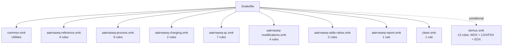
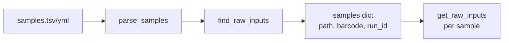
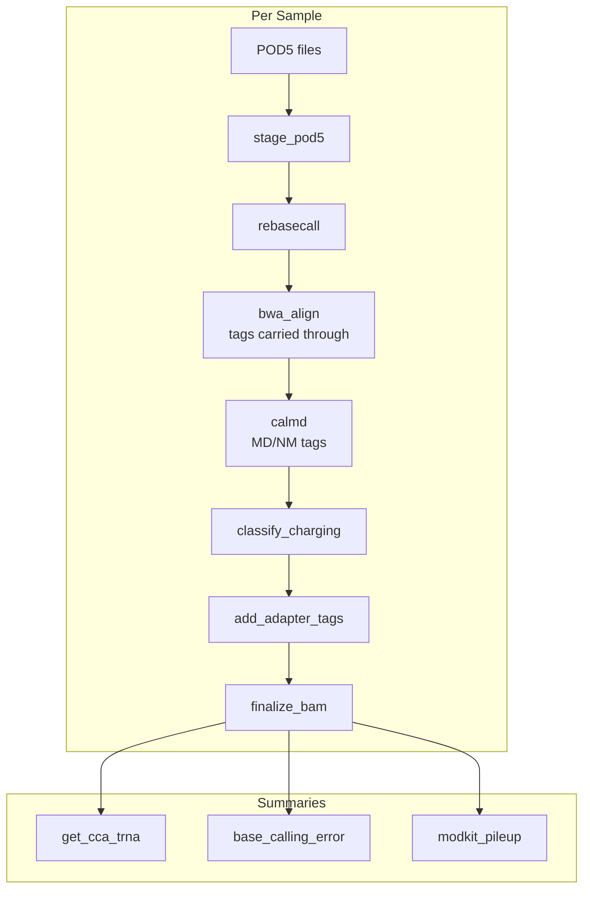
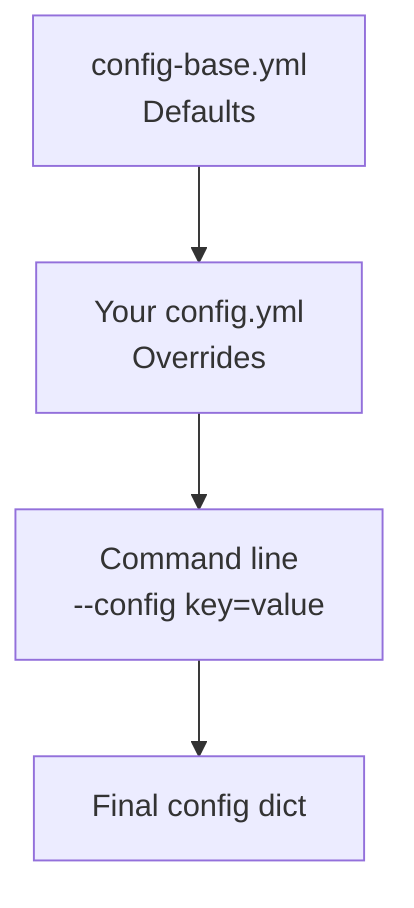

# Architecture

Technical architecture of the aa-tRNA-seq pipeline.

## Directory Structure

```
aa-tRNA-seq-pipeline/
├── workflow/
│   ├── Snakefile              # Main entry point
│   ├── rules/                 # Modular rule files
│   │   ├── common.smk               # Utilities and helpers
│   │   ├── aatrnaseq-reference.smk  # Reference validate/build/trim
│   │   ├── aatrnaseq-process.smk    # Core processing
│   │   ├── aatrnaseq-charging.smk   # Charging analysis
│   │   ├── aatrnaseq-qc.smk         # Quality control
│   │   ├── aatrnaseq-modifications.smk  # Modkit rules
│   │   ├── aatrnaseq-odds-ratios.smk    # Modification odds ratios
│   │   ├── aatrnaseq-report.smk         # Quarto QC report
│   │   ├── clean.smk                # On-demand intermediate cleanup
│   │   └── demux.smk          # WDX / LDX / FDX / EDX demux (conditional)
│   └── scripts/               # Python/shell processing scripts
├── config/
│   ├── config-base.yml        # Default configuration
│   ├── config-test.yml        # Test configuration
│   └── samples-*.tsv/yml      # Sample definitions
├── cluster/
│   ├── lsf/                   # LSF cluster profile
│   ├── slurm/                 # SLURM cluster profile
│   └── generic/               # Generic cluster profile
├── resources/
│   ├── ref/                   # Reference sequences
│   ├── models/                # Charging + demux model bundles
│   ├── kmers/                 # Kmer tables
│   └── tools/                 # External tools (dorado, escpod, WarpDemuX)
├── .tests/                    # Test data and scripts
├── pixi.toml                  # Pixi environment definition
└── pixi.lock                  # Locked dependencies
```

## Snakemake Organization

### Entry Point

`workflow/Snakefile` is the main entry point:

```python
# Load base configuration
configfile: "config/config-base.yml"

# Dynamic PATH setup: puts the pinned dorado + escpod bins on PATH for every
# job, and restores bash strict mode (shell.prefix REPLACES snakemake's
# default prefix, which IS `set -euo pipefail`)
onstart:
    ...

# Include rule modules
include: "rules/common.smk"
include: "rules/aatrnaseq-reference.smk"
include: "rules/aatrnaseq-process.smk"
include: "rules/aatrnaseq-charging.smk"
include: "rules/aatrnaseq-qc.smk"
include: "rules/aatrnaseq-modifications.smk"
include: "rules/aatrnaseq-odds-ratios.smk"
include: "rules/aatrnaseq-report.smk"
include: "rules/clean.smk"

# Conditionally include demux rules (WarpDemuX/WDX or escapepod/LDX+FDX)
if config.get("warpdemux", {}).get("enabled", False) or config.get("ldx", {}).get("enabled", False):
    include: "rules/demux.smk"

# Target rule
rule all:
    input:
        pipeline_outputs()
```

### Rule Modules



### Rule Categories

| Module | Purpose | Rules |
|--------|---------|-------|
| `common.smk` | Utilities, sample parsing, output definition | - |
| `aatrnaseq-reference.smk` | Reference validate/build/trim | 4 |
| `aatrnaseq-process.smk` | Core pipeline | 9 |
| `aatrnaseq-charging.smk` | Charging analysis | 2 |
| `aatrnaseq-qc.smk` | Quality control | 7 |
| `aatrnaseq-modifications.smk` | Modification calling | 4 |
| `aatrnaseq-odds-ratios.smk` | Modification odds ratios | 2 |
| `aatrnaseq-report.smk` | Quarto QC report | 1 |
| `clean.smk` | On-demand intermediate cleanup | 1 |
| `demux.smk` | Demultiplexing (WDX, LDX/FDX, EDX) | 13 |

## Key Functions in common.smk

### Sample Management

```python
def parse_samples(fl):
    """Auto-detect and parse sample file (TSV or YAML)."""

def parse_samples_tsv(fl):
    """Parse TSV format: sample_id<TAB>path"""

def parse_samples_yaml(fl):
    """Parse YAML format with barcode assignments."""

def find_raw_inputs():
    """Recursively find POD5 files in run directories."""
```

### Configuration Helpers

```python
def get_modkit_threshold_opts():
    """Build modkit threshold options from config."""

def get_pipeline_commit():
    """Get git commit ID for reproducibility."""

def is_demux_enabled():
    """Check if either demux backend (WarpDemuX or LDX) is enabled in config."""

def is_ldx_enabled():
    """Check if the escapepod (LDX) backend is enabled in config."""
```

### Output Definition

```python
def pipeline_outputs():
    """Define all final outputs for rule all."""
    outputs = []
    for sample in samples:
        outputs.extend([
            f"{outdir}/summary/tables/{sample}/{sample}.charging.cpm.tsv.gz",
            f"{outdir}/summary/tables/{sample}/{sample}.charging_prob.tsv.gz",
            f"{outdir}/summary/tables/{sample}/{sample}.bcerror.tsv.gz",
            # ... more outputs
        ])
    return outputs
```

## Data Flow

### Input Discovery



### Processing Pipeline



On the LDX/FDX path, `stage_pod5` and `rebasecall` are replaced by
`escapepod_demux` (+ `escapepod_demux_fdx`) → `rebasecall_ldx_run` →
`split_ldx_ubam`, rejoining at `bwa_align`. See
[Demultiplexing](../workflow/demultiplexing.md).

## Global Variables

Defined in `common.smk`:

```python
# Script directory path
SCRIPT_DIR = os.path.join(SNAKEFILE_DIR, "scripts")

# Output directory from config
outdir = config.get("output_directory", "results")

# Parsed samples dictionary
samples = parse_samples(config["samples"])
find_raw_inputs()  # Populates samples with POD5 paths
```

## Configuration System

### Hierarchy



### Key Config Sections

```yaml
# Tool paths and versions
base_calling_model: "resources/models/..."
dorado_version: 2.1.1

# Reference files
fasta: "resources/ref/..."
charging:
    model: "resources/models/charging/..."

# Command options
opts:
    dorado: "..."
    bwa: "..."
    bam_filter: "..."

# Modkit thresholds
modkit:
    filter_threshold: 0.5
    mod_thresholds: {...}

# Optional demux (mutually exclusive backends)
warpdemux:
    enabled: false
ldx:
    enabled: false
fdx:
    enabled: false  # needs ldx.enabled
```

## External Tools

### Tool Management

Tools are installed to `resources/tools/`:

```
resources/tools/
├── dorado/
│   └── <version>/
│       └── bin/dorado
└── escpod/
    └── <version>/
        └── bin/escpod
```

WarpDemuX is installed into the pixi conda environment instead (`pixi run
setup`), not vendored under `resources/tools/`.

### PATH Setup

Tools are added to PATH dynamically in the Snakefile's `onstart`, which also
restores bash strict mode (`shell.prefix()` replaces snakemake's default
prefix, and that default IS `set -euo pipefail`):

```python
onstart:
    dorado_bin_path = os.path.abspath(f"{DORADO_DIR}/bin")
    escpod_bin_path = os.path.abspath(f"{ESCPOD_DIR}/bin")
    tool_bins = f"{dorado_bin_path}:{escpod_bin_path}"
    os.environ["PATH"] = f"{tool_bins}:{os.environ['PATH']}"
    shell.prefix(f"set -euo pipefail; export PATH={tool_bins}:$PATH; ")
```

## Python Scripts

A sample, not exhaustive, of `workflow/scripts/`:

| Script | Called By | Purpose |
|--------|-----------|---------|
| `stamp_read_groups.py` | `bwa_align` | @RG/@CO header lines for `bwa mem -H` |
| `add_adapter_tags.py` | `add_adapter_tags` | Parasail-based adapter position tagging |
| `build_trna_reference.py` | `validate_reference`, `build_reference` | Reference validation/build |
| `select_demux_reads.py` | `ldx_run_read_ids`, `extract_ldx_sample_reads` | Join LDX/FDX axis calls per read |
| `detect_3p_adapters.py` | `detect_edx_adapters` | Per-read 3' adapter identity (EDX) |
| `get_charging_table.py` | `get_cca_trna` | Extract CL tag |
| `get_trna_charging_cpm.py` | `get_cca_trna_cpm` | Calculate CPM |
| `get_bcerror_freqs.py` | `base_calling_error` | Error metrics |
| `get_align_stats.py` | `align_stats` | Read statistics |

Scripts are called via `SCRIPT_DIR`:

```python
params:
    src=SCRIPT_DIR,
shell:
    "python {params.src}/script.py ..."
```

## Reproducibility

### Git Commit Tracking

```python
def get_pipeline_commit():
    """Return current git commit ID."""
    try:
        repo = Repo(SNAKEFILE_DIR, search_parent_directories=True)
        return repo.head.commit.hexsha[:8]
    except:
        return "unknown"
```

### Locked Dependencies

`pixi.lock` ensures reproducible environment:

```bash
# Install exact versions
pixi install

# Update lock file
pixi update
```

## Next Steps

- [Adding Rules](adding-rules.md) - Add new functionality
- [Contributing](contributing.md) - Contribution guidelines
