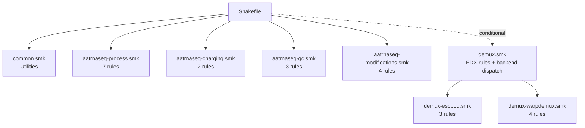
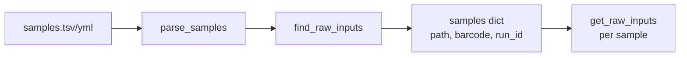
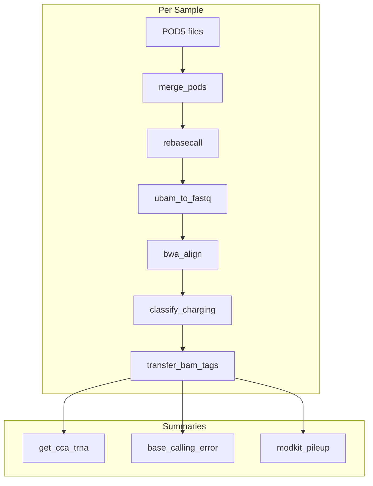
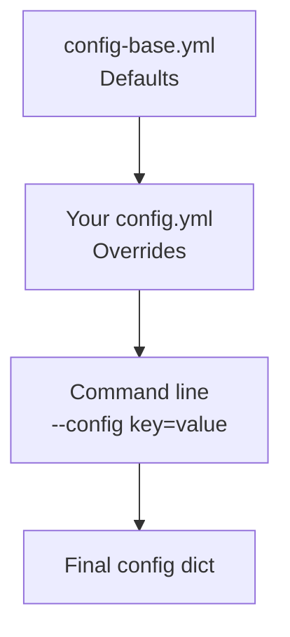

# Architecture

Technical architecture of the aa-tRNA-seq pipeline.

## Directory Structure

```
aa-tRNA-seq-pipeline/
├── workflow/
│   ├── Snakefile              # Main entry point
│   ├── rules/                 # Modular rule files
│   │   ├── common.smk         # Utilities and helpers
│   │   ├── aatrnaseq-process.smk    # Core processing
│   │   ├── aatrnaseq-charging.smk   # Charging analysis
│   │   ├── aatrnaseq-qc.smk         # Quality control
│   │   ├── aatrnaseq-modifications.smk  # Modkit rules
│   │   ├── demux.smk          # Demux dispatch + EDX rules (conditional)
│   │   ├── demux-escpod.smk   # escpod demux backend (default)
│   │   └── demux-warpdemux.smk # WarpDemuX backend
│   └── scripts/               # Python processing scripts
├── config/
│   ├── config-base.yml        # Default configuration
│   ├── config-test.yml        # Test configuration
│   └── samples-*.tsv/yml      # Sample definitions
├── cluster/
│   ├── lsf/                   # LSF cluster profile
│   └── generic/               # Generic cluster profile
├── resources/
│   ├── ref/                   # Reference sequences
│   ├── models/                # ML models
│   ├── kmers/                 # Kmer tables
│   └── tools/                 # External tools (dorado, escpod, leech wheels, WarpDemuX)
├── .tests/                    # Test data and scripts
├── pixi.toml                  # Pixi environment definition
└── pixi.lock                  # Locked dependencies
```

## Snakemake Organization

### Entry Point

`workflow/Snakefile` is the main entry point:

```python
# Load base configuration
configfile: "config/config-base.yml"

# Dynamic PATH setup
onstart:
    # Add dorado and modkit to PATH
    dorado_path = f"resources/tools/dorado/{config['dorado_version']}/bin"
    os.environ["PATH"] = f"{dorado_path}:{os.environ['PATH']}"

# Include rule modules
include: "rules/common.smk"
include: "rules/aatrnaseq-process.smk"
include: "rules/aatrnaseq-charging.smk"
include: "rules/aatrnaseq-qc.smk"
include: "rules/aatrnaseq-modifications.smk"

# Conditionally include demux rules. demux.smk dispatches on warpdemux.backend
# and includes either demux-escpod.smk (default) or demux-warpdemux.smk.
if is_demux_enabled():
    include: "rules/demux.smk"

# Target rule
rule all:
    input:
        pipeline_outputs()
```

### Rule Modules



### Rule Categories

| Module | Purpose | Rules |
|--------|---------|-------|
| `common.smk` | Utilities, sample parsing, output definition | - |
| `aatrnaseq-process.smk` | Core pipeline | 7 |
| `aatrnaseq-charging.smk` | Charging analysis | 2 |
| `aatrnaseq-qc.smk` | Quality control | 3 |
| `aatrnaseq-modifications.smk` | Modification calling | 4 |
| `demux.smk` | Backend dispatch + EDX splitting/concordance | 5 |
| `demux-escpod.smk` | escpod demux backend (default) | 3 |
| `demux-warpdemux.smk` | WarpDemuX backend | 4 |

## Key Functions in common.smk

### Sample Management

```python
def parse_samples(fl):
    """Auto-detect and parse sample file (TSV or YAML)."""

def parse_samples_tsv(fl):
    """Parse TSV format: sample_id<TAB>path"""

def parse_samples_yaml(fl):
    """Parse YAML format with barcode assignments."""

def find_raw_inputs():
    """Recursively find POD5 files in run directories."""
```

### Configuration Helpers

```python
def get_modkit_threshold_opts():
    """Build modkit threshold options from config."""

def get_pipeline_commit():
    """Get git commit ID for reproducibility."""

def is_demux_enabled():
    """Check if demultiplexing is enabled in config (warpdemux.enabled)."""
```

Backend dispatch lives in `demux.smk`:

```python
def get_demux_backend():
    """Demultiplexing backend: 'escpod' (default) or 'warpdemux'."""

def wdx_to_escpod_barcode(barcode):
    """Map 'barcode03'/'WDX_bc03' to escpod's 'BC03' label."""
```

### Output Definition

```python
def pipeline_outputs():
    """Define all final outputs for rule all."""
    outputs = []
    for sample in samples:
        outputs.extend([
            f"{outdir}/summary/tables/{sample}/{sample}.charging.cpm.tsv.gz",
            f"{outdir}/summary/tables/{sample}/{sample}.charging_prob.tsv.gz",
            f"{outdir}/summary/tables/{sample}/{sample}.bcerror.tsv.gz",
            # ... more outputs
        ])
    return outputs
```

## Data Flow

### Input Discovery



### Processing Pipeline



## Global Variables

Defined in `common.smk`:

```python
# Script directory path
SCRIPT_DIR = os.path.join(SNAKEFILE_DIR, "scripts")

# Output directory from config
outdir = config.get("output_directory", "results")

# Parsed samples dictionary
samples = parse_samples(config["samples"])
find_raw_inputs()  # Populates samples with POD5 paths
```

## Configuration System

### Hierarchy



### Key Config Sections

```yaml
# Tool paths and versions
base_calling_model: "resources/models/..."
dorado_version: 1.4.0

# Reference files
fasta: "resources/ref/..."
remora_cca_classifier: "resources/models/..."

# Command options
opts:
    dorado: "..."
    bwa: "..."
    bam_filter: "..."

# Modkit thresholds
modkit:
    filter_threshold: 0.5
    mod_thresholds: {...}

# Pinned tool versions
escapepod_version: v0.6.2   # escpod CLI source build + escapepod PyPI package
leech_version: v0.4.1       # leech release wheels
leech_core_version: 0.3.0   # optional Rust extension wheel

# Optional demux
warpdemux:
    enabled: false
    backend: "escpod"       # or "warpdemux"
```

## External Tools

### Tool Management

Tools are installed to `resources/tools/` by `scripts/setup-tools.sh` (`pixi run setup`):

```
resources/tools/
├── dorado/
│   └── <version>/
│       └── bin/dorado
├── escapepod/
│   └── <version>/
│       └── bin/escpod       # cargo install from source, --features cnn-detect
├── leech/
│   └── <version>/           # downloaded release wheels
└── WarpDemuX/               # git clone, pip install -e
```

`escpod` must be a source build (Rust >= 1.95): the published escapepod-rs release
binaries are default-features only and lack a working `escpod demux`. leech comes from the
private repo's release wheels via `gh` (or `LEECH_WHEEL_DIR`) — it is no longer a git
submodule.

### PATH Setup

`scripts/setup-env.sh` runs on `pixi shell` activation and prepends the dorado and escpod
bin directories to `PATH`. `Snakefile`'s `onstart` hook re-adds dorado for shell commands
and validates that each expected tool resolves inside the environment:

```python
onstart:
    dorado_path = f"resources/tools/dorado/{config['dorado_version']}/bin"
    os.environ["PATH"] = f"{dorado_path}:{os.environ['PATH']}"
    # ... then checks dorado, samtools, bwa, modkit, remora, escpod,
    # plus leech / warpdemux / `escpod demux` depending on config
```

## Python Scripts

Located in `workflow/scripts/`:

| Script | Called By | Purpose |
|--------|-----------|---------|
| `transfer_tags.py` | `transfer_bam_tags` | Transfer BAM tags |
| `get_charging_table.py` | `get_cca_trna` | Extract CL tag |
| `get_trna_charging_cpm.py` | `get_cca_trna_cpm` | Calculate CPM |
| `get_bcerror_freqs.py` | `base_calling_error` | Error metrics |
| `get_align_stats.py` | `align_stats` | Read statistics |
| `extract_signal_metrics.py` | `remora_signal_stats` | Signal metrics |

Scripts are called via `SCRIPT_DIR`:

```python
params:
    src=SCRIPT_DIR,
shell:
    "python {params.src}/script.py ..."
```

## Reproducibility

### Git Commit Tracking

```python
def get_pipeline_commit():
    """Return current git commit ID."""
    try:
        repo = Repo(SNAKEFILE_DIR, search_parent_directories=True)
        return repo.head.commit.hexsha[:8]
    except:
        return "unknown"
```

### Locked Dependencies

`pixi.lock` ensures reproducible environment:

```bash
# Install exact versions
pixi install

# Update lock file
pixi update
```

## Next Steps

- [Adding Rules](adding-rules.md) - Add new functionality
- [Contributing](contributing.md) - Contribution guidelines
