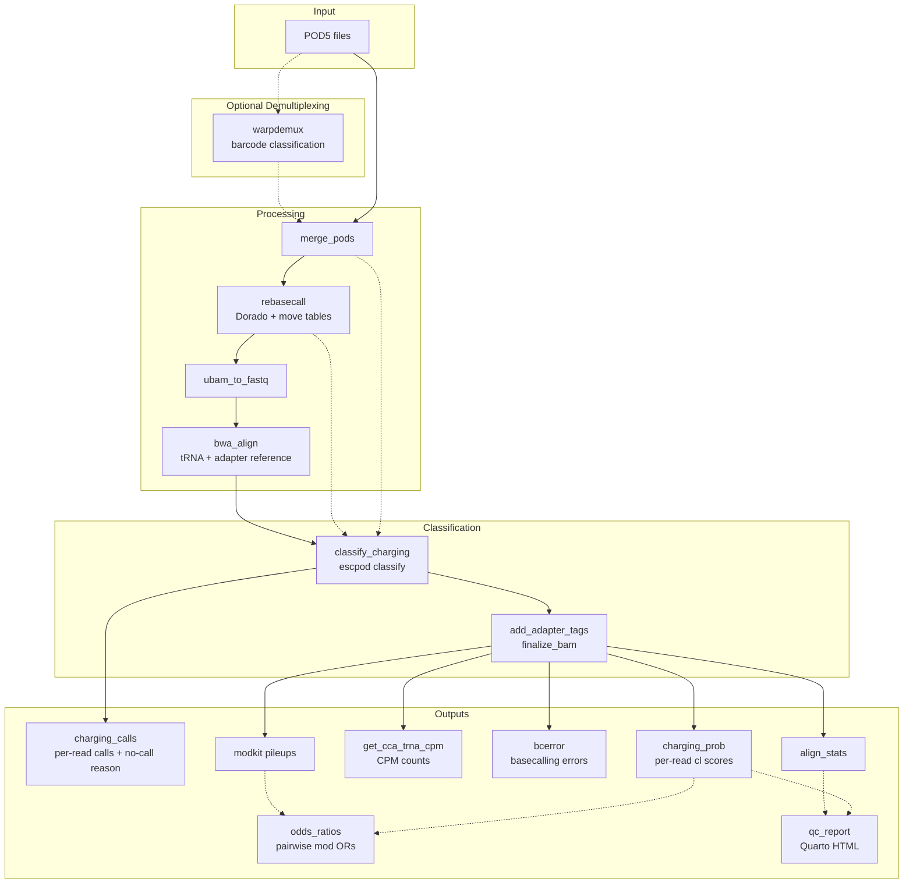

# aa-tRNA-seq Pipeline

A Snakemake pipeline for analyzing Oxford Nanopore direct RNA sequencing of aminoacylated tRNAs.

[](https://github.com/rnabioco/aa-tRNA-seq-pipeline/blob/main/LICENSE)
[](https://snakemake.github.io)

## Overview

This pipeline processes Oxford Nanopore Technologies (ONT) aa-tRNA-seq data to distinguish between **charged (aminoacylated)** and **uncharged** tRNA molecules. It uses a machine learning model, run by `escpod classify`, trained on nanopore signal data over the CCA 3' end of tRNA molecules.



## Pipeline Steps

Given a directory of POD5 files, this pipeline:

1. **Merges** all POD5 files per sample into a single file
2. **Rebasecalls** with Dorado to generate unmapped BAM with move tables (required by the charging model)
3. **Converts** BAM to FASTQ and **aligns** to tRNA + adapter reference with BWA MEM
4. **Classifies** charged vs. uncharged reads with `escpod classify`, against an ONNX model trained on nanopore signal over the CCA 3' end

The classification writes a `cl` tag (0-255) onto each scored read, `round(P(charged) * 255)`. By default `cl` ≥ 200 is charged and < 200 uncharged. Reads the model abstains on get no `cl` tag; their rate is charging-correlated and is reported in `read_attrition.tsv.gz`.

## Key Features

- **Charging Classification**: ML-based classification of charged vs uncharged tRNAs via `escpod classify`
- **Modification Calling**: Detection of RNA modifications (pseU, m5C, m6A, inosine) via Dorado and Modkit
- **Full-Length Filtering**: Only full-length tRNA reads with proper adapters are analyzed
- **Barcode Demultiplexing**: Optional WarpDemuX support for pooled/multiplexed samples
- **Cluster Support**: Optimized profiles for LSF and SLURM schedulers
- **Reproducibility**: Git commit tracking and locked dependencies via Pixi

## Quick Start

```bash
# Clone repository
git clone https://github.com/rnabioco/aa-tRNA-seq-pipeline.git
cd aa-tRNA-seq-pipeline

# Install environment
pixi install

# One-time setup: download tools, models, and test data
pixi run setup
pixi run dl-test-data

# Run test pipeline
pixi run dry-run   # Preview what will run
pixi run test      # Execute with test data
```

See [Installation](getting-started/installation.md) for detailed setup instructions.

## Documentation Sections

<div class="grid cards" markdown>

-   :material-rocket-launch: **Getting Started**

    ---

    Install the pipeline and run your first analysis

    [:octicons-arrow-right-24: Installation](getting-started/installation.md)

-   :material-cog: **User Guide**

    ---

    Configure samples, parameters, and understand outputs

    [:octicons-arrow-right-24: Configuration](user-guide/configuration.md)

-   :material-graph: **Workflow**

    ---

    Detailed documentation of all rules and scripts

    [:octicons-arrow-right-24: Overview](workflow/overview.md)

-   :material-server: **Cluster Setup**

    ---

    Configure LSF, SLURM, or other HPC schedulers

    [:octicons-arrow-right-24: LSF Setup](cluster/lsf-setup.md)

</div>

## Output Overview

The pipeline produces several key output files per sample:

| Output | Description |
|--------|-------------|
| `bam/final/{sample}/{sample}.bam` | Final BAM with charging (`cl`), adapter (`pt`) and barcode (`BC`) tags |
| `summary/tables/{sample}/{sample}.charging.cpm.tsv.gz` | CPM-normalized charging counts per tRNA |
| `summary/tables/{sample}/{sample}.charging_prob.tsv.gz` | Per-read charging probabilities |
| `summary/modkit/{sample}/{sample}.pileup.bed.gz` | Modification pileup consensus |

See [Output Files](user-guide/outputs.md) for complete documentation.

## Downstream Analysis

Downstream analysis to generate figures for the initial preprint can be found at: [https://github.com/rnabioco/aa-tRNA-seq](https://github.com/rnabioco/aa-tRNA-seq)

## Citation

If you use this pipeline, please cite:

> White LK, Radakovic A, Sajek MP, Dobson K, Riemondy KA, Del Pozo S, Szostak JW, Hesselberth JR. Nanopore sequencing of intact aminoacylated tRNAs. *Nat Commun.* 2025;16:7781. doi:[10.1038/s41467-025-62545-9](https://doi.org/10.1038/s41467-025-62545-9)

## License

This project is licensed under the MIT License - see the [LICENSE](https://github.com/rnabioco/aa-tRNA-seq-pipeline/blob/main/LICENSE) file for details.
