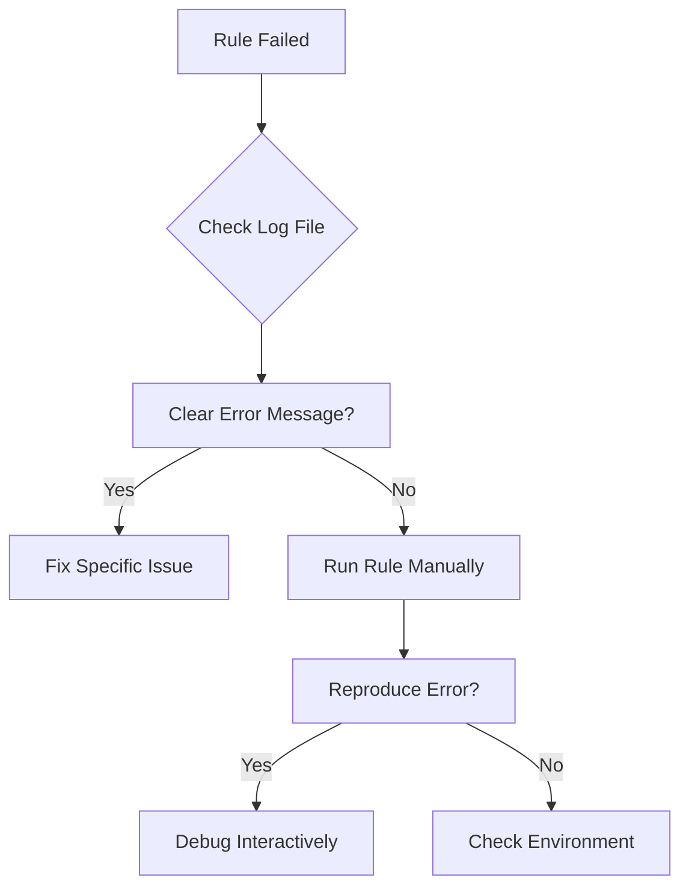

# Debugging

Techniques for debugging pipeline issues.

## Debugging Workflow



## Log Files

### Location

Rule logs are stored in the output directory:

```
{output_directory}/logs/{rule_name}/{sample}
```

### Viewing Logs

```bash
# View specific rule log
cat results/logs/rebasecall/sample1

# View last 50 lines
tail -50 results/logs/classify_charging/sample1

# Search for errors
grep -i error results/logs/*/*.log
```

### Cluster Job Logs

=== "LSF"

    ```bash
    # Find job output files
    ls -la *.out *.err

    # View job output
    cat <job_id>.out

    # Get job history
    bhist -l <job_id>
    ```

=== "SLURM"

    ```bash
    # Find job output
    ls -la slurm-*.out

    # View job output
    cat slurm-<job_id>.out
    ```

## Dry Run Analysis

### Check DAG

Preview what will run:

```bash
pixi run snakemake -n --configfile=config/config.yml
```

### Print Commands

See the actual shell commands:

```bash
pixi run snakemake -n -p --configfile=config/config.yml
```

### Generate DAG Image

Visualize the workflow:

```bash
pixi run dag
# Creates dag.svg
```

## Running Rules Manually

### Identify the Command

Get the shell command for a rule:

```bash
pixi run snakemake -n -p <rule_name> --configfile=config/config.yml
```

### Run in Interactive Shell

Start a pixi shell:

```bash
pixi shell
```

Then run commands manually:

```bash
# Example: test bwa alignment
bwa mem -C -t 4 -W 13 -k 6 -T 20 -x ont2d \
    resources/ref/sacCer3-mature-tRNAs-dual-adapt-v2.fa \
    results/fq/sample1.fq.gz \
    | samtools view -Sb - \
    > test.bam
```

### Test Python Scripts

```bash
pixi shell

# Test a script directly
python workflow/scripts/get_charging_table.py --help

python workflow/scripts/get_charging_table.py \
    --tag CL \
    results/bam/final/sample1.bam \
    test_output.tsv.gz
```

## Snakemake Debugging

### Summary Report

Get status of all files:

```bash
pixi run snakemake --summary --configfile=config/config.yml
```

### Detailed Report

Generate execution report:

```bash
pixi run snakemake --report report.html --configfile=config/config.yml
```

### Reason for Execution

See why rules will run:

```bash
pixi run snakemake -n --reason --configfile=config/config.yml
```

### Force Re-run

Force a specific rule:

```bash
pixi run snakemake --forcerun <rule> --configfile=config/config.yml
```

Force from a rule onwards:

```bash
pixi run snakemake --forcerun <rule> --forceall --configfile=config/config.yml
```

## Common Debug Scenarios

### Input File Missing

**Symptom:**
```
MissingInputException
```

**Debug:**

1. Check if prerequisite completed:
   ```bash
   ls -la results/path/to/expected/input
   ```

2. Check DAG for dependencies:
   ```bash
   pixi run snakemake --dag <target> | dot -Tpng > debug.png
   ```

### Rule Produces Empty Output

**Debug:**

1. Check the input file:
   ```bash
   samtools view results/bam/input.bam | head
   ```

2. Run command manually with verbose output

3. Check filtering parameters

### Memory Issues

**Debug:**

1. Monitor memory during execution:
   ```bash
   # On local machine
   watch -n 1 free -h

   # Check cluster job
   bjobs -l <job_id> | grep -i mem
   ```

2. Profile the rule:
   ```bash
   /usr/bin/time -v <command>
   ```

### GPU Issues

**Debug:**

1. Check GPU availability:
   ```bash
   nvidia-smi
   ```

2. Test CUDA:
   ```bash
   python -c "import torch; print(torch.cuda.is_available())"
   ```

3. Check CUDA_VISIBLE_DEVICES:
   ```bash
   echo $CUDA_VISIBLE_DEVICES
   ```

## Environment Issues

### Check Installed Packages

```bash
pixi list
```

### Check Tool Versions

```bash
# Dorado
resources/tools/dorado/*/bin/dorado --version

# Modkit (managed by pixi)
pixi run modkit --version

# Snakemake
pixi run snakemake --version
```

### Recreate Environment

```bash
# Clean and reinstall
rm -rf .pixi
pixi install
```

## File Inspection

### BAM Files

```bash
# View header
samtools view -H results/bam/final/sample1.bam

# View first few reads
samtools view results/bam/final/sample1.bam | head

# Check specific tags
samtools view results/bam/final/sample1.bam | head -1 | tr '\t' '\n' | grep "^CL:"

# Get statistics
samtools flagstat results/bam/final/sample1.bam
```

### POD5 Files

```bash
# Summary
pod5 inspect summary results/pod5/sample1/sample1.pod5

# Read info
pod5 inspect reads results/pod5/sample1/sample1.pod5 | head
```

### TSV Files

```bash
# View compressed TSV
zcat results/summary/tables/sample1/sample1.charging.cpm.tsv.gz | column -t | head

# Count lines
zcat results/summary/tables/sample1/sample1.charging_prob.tsv.gz | wc -l
```

## Getting Help

### Create a Minimal Example

When reporting issues:

1. Identify the failing rule
2. Create minimal reproduction:
   ```bash
   pixi run snakemake <specific_output> -n -p --configfile=config/config-test.yml
   ```

3. Include:
   - Error message
   - Log file contents
   - Config used
   - Environment info

### File an Issue

[GitHub Issues](https://github.com/rnabioco/aa-tRNA-seq-pipeline/issues)

Include:

```markdown
## Environment
- OS: [e.g., CentOS 7]
- Snakemake version: [pixi run snakemake --version]
- Execution mode: [local/LSF/SLURM]

## Error
[Error message]

## Steps to Reproduce
1. [Step 1]
2. [Step 2]

## Log Output
```
[Paste relevant log output]
```

## Config
```yaml
[Relevant config]
```
```
