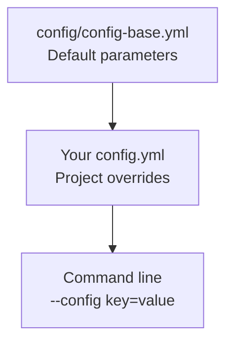

# Configuration

The pipeline uses YAML configuration files with a hierarchical inheritance system.

## Configuration Hierarchy



Your project config inherits all defaults from `config-base.yml` and only needs to specify overrides.

## Configuration Files

| File | Purpose |
|------|---------|
| `config/config-base.yml` | Base defaults (included by Snakefile) |
| `config/config-test.yml` | Test data configuration |
| `config/config-preprint.yml` | Preprint analysis configuration |
| `config/config-demux-test.yml` | Demultiplexing test configuration |

## Required Parameters

These parameters must be set in your config:

```yaml
# Path to sample file (TSV or YAML)
samples: config/samples-myproject.tsv

# Output directory for all pipeline results
output_directory: "results/myproject"
```

## Reference Files

### Basecalling Model

```yaml
# Path to Dorado model directory or model name for auto-download
base_calling_model: "resources/models/rna004_130bps_sup@v5.3.0"
```

The model is downloaded automatically if using a model name.

### Reference FASTA

```yaml
# tRNA reference with adapters for BWA alignment
fasta: "resources/ref/sacCer3-mature-tRNAs-dual-adapt-v2.fa"
```

A BWA index is built automatically if it doesn't exist.

### Adapter Sequences

The pipeline uses adapter sequences for reference validation and building. These must match what the Remora charging model was trained on:

```yaml
adapters:
  # 5' adapter prepended to tRNA (23bp)
  five_prime: "CCTAAGAGCAAGAAGAAGCCTGG"
  # 3' adapter appended after tRNA CCA end (40bp)
  three_prime: "GGCTTCTTCTTGCTCTTCCAACCTTGCCTTAAAAAAAAAA"
```

!!! important "CCAGGC Junction"
    The charging classification uses the **CCAGGC** 6-mer junction where:

    - **CCA** = last 3 bases of mature tRNA
    - **GGC** = first 3 bases of 3' adapter

    The 3' adapter **must** start with GGC for classification to work correctly.

### Reference Validation and Building

The pipeline validates that the reference FASTA has proper adapter structure before alignment:

```yaml
reference:
  # Mode: "validate" (default) or "build"
  mode: "validate"
  # For build mode: path to raw tRNA FASTA (without adapters)
  raw_fasta: null
```

| Mode | Description |
|------|-------------|
| `validate` | Check existing adapted reference has correct structure |
| `build` | Create adapted reference from raw tRNA sequences |

#### Validate Mode (Default)

Checks that each sequence in your reference has:

- Correct 5' adapter prefix
- tRNA portion ending with CCA
- Correct 3' adapter suffix (starting with GGC)
- Valid CCAGGC junction for charging classification

#### Build Mode

Creates an adapted reference from raw tRNA sequences:

1. Reads raw tRNA FASTA (without adapters)
2. Adds CCA to sequences missing it (with warning)
3. Prepends 5' adapter
4. Appends 3' adapter after CCA
5. Verifies CCAGGC junction is created

```yaml
# Example: building reference from raw tRNAs
reference:
  mode: "build"
  raw_fasta: "resources/ref/my_raw_trnas.fa"
```

!!! info "Custom References"
    To use a custom reference, either:

    1. Use `mode: "validate"` with a pre-adapted FASTA
    2. Use `mode: "build"` with raw tRNA sequences (CCA endings required or will be added)

### Remora Models

```yaml
# Kmer level table for signal extraction (from ONT kmer_models repo)
remora_kmer_table: "resources/kmers/9mer_levels_v1.txt"

# Trained ML model for charging classification
remora_cca_classifier: "resources/models/cca_classifier.pt"
```

## Tool Versions

```yaml
# Dorado basecaller version
dorado_version: 1.4.0
dorado_model: rna004_130bps_sup@v5.3.0
```

Modkit is managed via Pixi and specified in `pixi.toml`.

## Modkit Thresholds

Optimized thresholds for modification calling based on [ModkitOpt](https://github.com/comprna/modkitopt):

```yaml
modkit:
    # Global canonical base confidence threshold
    filter_threshold: 0.5

    # Per-modification pass thresholds
    mod_thresholds:
        a: 0.99       # m6A (N6-methyladenosine)
        m: 0.99       # m5C (5-methylcytosine)
        "17802": 0.995  # pseU (pseudouridine)
        "17596": 0.99   # inosine
```

These thresholds improve F1 scores by 51% (m6A) and 1251% (pseU) compared to defaults.

## Command-Line Options

### Dorado Options

```yaml
opts:
    dorado: " --modified-bases pseU m5C inosine_m6A --emit-moves "
```

| Option | Description |
|--------|-------------|
| `--modified-bases` | Modifications to call during basecalling |
| `--emit-moves` | Output move tables (required for Remora) |

### BWA Options

```yaml
opts:
    bwa: " -W 13 -k 6 -T 20 -x ont2d"
```

| Option | Description |
|--------|-------------|
| `-W 13` | Band width for banded alignment |
| `-k 6` | Minimum seed length |
| `-T 20` | Minimum alignment score |
| `-x ont2d` | ONT 2D read preset |

These parameters are optimized for tRNA alignment based on Novoa lab research.

### BAM Filtering

```yaml
opts:
    bam_filter: "-5 24 -3 23 -s"
```

| Option | Description |
|--------|-------------|
| `-5 24` | Allow up to 24bp 5' truncation |
| `-3 23` | Require at least 23bp 3' adapter |
| `-s` | Require positive strand |

### Coverage Options

```yaml
opts:
    coverage: "--filterRNAstrand 'reverse' --samFlagExclude 256"
```

| Option | Description |
|--------|-------------|
| `--filterRNAstrand 'reverse'` | Filter by RNA strand |
| `--samFlagExclude 256` | Exclude non-primary alignments |

## Demultiplexing

For multiplexed samples, enable barcode demultiplexing:

```yaml
warpdemux:
    enabled: true
    backend: "escpod"                     # "escpod" (default) or "warpdemux"
    barcode_kit: "WDX4_tRNA_rna004_v1_0"  # warpdemux backend
    save_boundaries: true                 # warpdemux backend
    threads: 8

    # escpod backend only
    method: "cnn"                         # "cnn" (default) or "llr"
    barcode_model: "resources/models/demux/barcode_wdx4_rna004.gbm.json"
    adapter_model: "resources/models/demux/adapter_rna004.onnx"
```

The section name is kept as `warpdemux` for backward compatibility. `backend` selects
between `escpod demux` (Rust, one fused classify+split pass — the default) and the
original [WarpDemuX](https://github.com/KleistLab/WarpDemuX) python implementation. Both
write the same downstream files.

!!! warning "Backends give different barcode calls"
    `escpod` cannot load a WarpDemuX kit, so it uses `barcode_wdx4_rna004`, a GBM
    distilled from the `WDX4_tRNA_rna004_v1_0` teacher. Barcode numbering is unchanged,
    but the shipped GBM has no per-class confidence thresholds, so the `unclassified`
    fraction drops sharply. Install the models with `pixi run install-demux-models` and
    see [Demultiplexing](../workflow/demultiplexing.md#choosing-a-backend) before
    switching.

### Available Barcode Kits

| Kit | Barcodes | Notes |
|-----|----------|-------|
| `WDX4_tRNA_rna004_v1_0` | bc03, bc04, bc05, bc07 | Recommended, +3-7% recovery |
| `WDX4b_tRNA_rna004_v1_0` | bc04, bc05, bc07, bc11 | Alternative |

`barcode_kit` applies to the `warpdemux` backend. The escpod backend's shipped
`barcode_wdx4_rna004` model covers the same barcodes as `WDX4_tRNA_rna004_v1_0`
(bc03, bc04, bc05, bc07); there is no escpod equivalent of `WDX4b_tRNA_rna004_v1_0`.

!!! warning "Protocol Compatibility"
    WarpDemuX-tRNA models (and the escpod model distilled from them) work with the
    Nano-tRNAseq protocol only. They do NOT work with Thomas splint adapter data.

See [Demultiplexing](../workflow/demultiplexing.md) for detailed setup.

## Example Configurations

### Minimal Config

```yaml
samples: config/samples.tsv
output_directory: "results/analysis"
```

### Custom Reference

```yaml
samples: config/samples.tsv
output_directory: "results/analysis"
fasta: "path/to/my/reference.fa"
remora_cca_classifier: "path/to/my/model.pt"
```

### With Demultiplexing

```yaml
samples: config/samples.yml  # YAML format required
output_directory: "results/analysis"
warpdemux:
    enabled: true
    backend: "escpod"
    barcode_model: "resources/models/demux/barcode_wdx4_rna004.gbm.json"
```

### High-Stringency Modification Calling

```yaml
samples: config/samples.tsv
output_directory: "results/analysis"
modkit:
    filter_threshold: 0.7
    mod_thresholds:
        a: 0.995
        m: 0.995
        "17802": 0.999
        "17596": 0.995
```

## Command-Line Overrides

Override any config parameter at runtime:

```bash
pixi run snakemake --configfile=config/config.yml \
    --config output_directory="results/test2"
```

## Next Steps

- [Sample Files](samples-format.md) - Define your samples
- [Running Pipeline](running-pipeline.md) - Execute the pipeline
