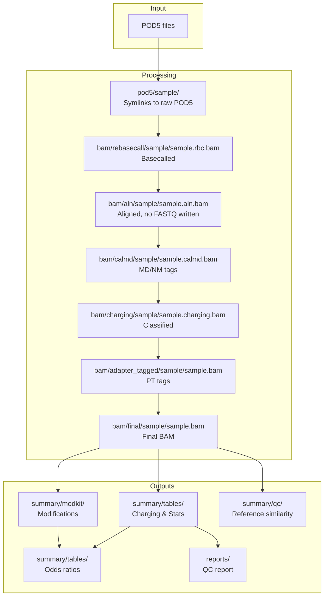

# Output Files

This guide documents all output files produced by the pipeline.

## Output Directory Structure

```
{output_directory}/
├── reference/               # Validated/built reference FASTA + report
├── pod5/                    # Per-sample directory of symlinks to raw POD5 (no copy)
├── bam/                     # BAM files at each stage (rebasecall, aln, calmd, charging, adapter_tagged, final)
├── summary/                 # Analysis outputs
│   ├── tables/             # Tabular summaries (charging, CPM, calls, QC)
│   ├── modkit/             # Modification calling
│   └── qc/                 # Reference QC metrics
├── reports/                 # Rendered QC reports
├── demux/                   # Demultiplexing outputs (if enabled)
├── logs/                    # Rule execution logs
└── squiggy-session.json     # Squiggy session file for Positron
```

No `fq/` directory is written: `bwa_align` streams the uBAM straight through
`samtools fastq` into `bwa mem` in one pass, carrying dorado's tags via the
FASTQ comment.

## Data Flow and Outputs



## Core Outputs

### Final BAM

`bam/final/{sample}/{sample}.bam`

The final BAM file with charging classification, adapter positions and barcode.

**Tags:**

| Tag | Type | Description |
|-----|------|-------------|
| `cl` | `i` | Charging likelihood, `round(P(charged) * 255)` (0-255). Absent = no-call |
| `pt` | `Z` | Adapter positions (5' and 3' boundaries) |
| `BC` | `Z` | Barcode the read was demultiplexed to. Absent on non-demux runs |

Tag names are **case-sensitive** and these are the exact spellings: `cl` and
`pt` are lowercase (the SAM spec's local-use space), `BC` is the spec-reserved
barcode tag. Dorado's `MM`/`ML` modbase tags and its `mv`/`ts`/`ns` move-table
tags are preserved alongside them.

**Header:** the BAM carries a valid `@RG` whose `SM`, `LB` and `BC` are the
pipeline's sample, run id and barcode, with dorado's read-group `ID` and its
basecall-model provenance (`DS`, `PU`, `PM`, `DT`) preserved. On a
demultiplexed run an `@CO` line records the upstream barcode name, e.g.
`aa-tRNA-seq:upstream_barcode=nbc04` for `BC:Z:ldx04`.

**View tags:**

```bash
samtools view results/bam/final/sample1/sample1.bam | head -1 | tr '\t' '\n' | grep -E "^(cl|pt|BC):"
samtools view -H results/bam/final/sample1/sample1.bam | grep -E "^@(RG|CO)"
```

**Split a merged BAM back apart by barcode:**

```bash
samtools split -d BC merged.bam
```

!!! note "`cl` and the modbase tags"
    The charging call lands in its own `cl` tag (uint8, `round(P(charged) * 255)`), written directly by `escpod classify`. Dorado's `MM`/`ML` modbase tags are left untouched, which is what modkit reads — there is no tag round-trip and no `cm` tag any more.

!!! note "Why `BC` is written at all"
    Until it was added, a read's barcode existed **only** in the output path. The
    per-read record that could recover it (`demux/read_ids/`) is removed by the
    `clean` rule and, on the WarpDemuX path, is `temp()` under the
    `demux_scratch` cleanup tier — so a finished run could end up with no
    per-read barcode record anywhere. `BC` travels with the read instead.

!!! warning "A missing `cl` tag is not an uncharged call"
    Reads the model abstains on carry no `cl` tag. See the charging calls table below.

### Charging Probability Table

`summary/tables/{sample}/{sample}.charging_prob.tsv.gz`

Per-read charging likelihood scores.

| Column | Description |
|--------|-------------|
| `read_id` | Nanopore read identifier |
| `tRNA` | Aligned tRNA reference |
| `charging_likelihood` | ML score (0-255) |

**Interpretation:**

- Score ≥ 200: Charged (aminoacylated)
- Score < 200: Uncharged

**Example:**

```bash
zcat results/summary/tables/sample1/sample1.charging_prob.tsv.gz | head
```

```
read_id                                 tRNA                    charging_likelihood
00a1b2c3-4567-89ab-cdef-0123456789ab   tRNA-Ala-AGC-1-1        245
00a1b2c3-4567-89ab-cdef-0123456789ac   tRNA-Gly-GCC-2-1        87
```

### Charging CPM Table

`summary/tables/{sample}/{sample}.charging.cpm.tsv.gz`

Per-tRNA aggregated charging counts, normalized to CPM (counts per million).

| Column | Description |
|--------|-------------|
| `tRNA` | tRNA reference name |
| `counts_charged` | Number of charged reads |
| `counts_uncharged` | Number of uncharged reads |
| `cpm_charged` | Charged CPM |
| `cpm_uncharged` | Uncharged CPM |

**Example:**

```bash
zcat results/summary/tables/sample1/sample1.charging.cpm.tsv.gz | column -t | head
```

```
tRNA              counts_charged  counts_uncharged  cpm_charged  cpm_uncharged
tRNA-Ala-AGC-1-1  1523            234               15230.5      2340.2
tRNA-Gly-GCC-2-1  892             1456              8920.3       14560.8
```

## Quality Control Outputs

### Alignment Statistics

`summary/tables/{sample}/{sample}.align_stats.tsv.gz`

Read counts through pipeline stages.

| Column | Description |
|--------|-------------|
| `bam_file` | BAM file path |
| `id` | Sample identifier |
| `info` | Pipeline stage |
| `n_reads` | Total reads |
| `pct_mapped` | Percent mapped |
| `mapped_reads` | Number mapped |
| `pos_reads` | Positive strand reads |
| `mapq0_reads` | MAPQ 0 reads |
| `mean_length` | Mean read length |
| `mean_bq` | Mean base quality |
| `mean_mapq` | Mean mapping quality |

### Base Calling Errors

`summary/tables/{sample}/{sample}.bcerror.tsv.gz`

Per-position base calling error metrics.

| Column | Description |
|--------|-------------|
| `Position` | Reference position |
| `Coverage` | Read coverage |
| `A_Freq`, `T_Freq`, `G_Freq`, `C_Freq` | Base frequencies |
| `MismatchFreq` | Mismatch frequency |
| `InsertionFreq` | Insertion frequency |
| `DeletionFreq` | Deletion frequency |
| `BCErrorFreq` | Combined error frequency |
| `MeanQual` | Mean base quality |

### Coverage Tracks

`summary/tables/{sample}/{sample}.{cpm,counts}.bg.gz`

BedGraph coverage tracks for visualization.

- `.cpm.bg.gz` - CPM-normalized coverage
- `.counts.bg.gz` - Raw count coverage

**Load in IGV:**

```bash
gunzip -c results/summary/tables/sample1/sample1.cpm.bg.gz > sample1.cpm.bg
# Load sample1.cpm.bg in IGV
```

## Modification Outputs

### Modification Pileup

`summary/modkit/{sample}/{sample}.pileup.bed.gz`

Per-site modification consensus in BED format.

| Column | Description |
|--------|-------------|
| `chrom` | Reference name |
| `start` | Start position |
| `end` | End position |
| `mod` | Modification type |
| `score` | Modification score |
| `strand` | Strand |
| Additional | Modkit-specific columns |

### Per-Read Modification Calls

`summary/modkit/{sample}/{sample}.mod_calls.tsv.gz`

Individual modification calls per read.

### Full Modification Export

`summary/modkit/{sample}/{sample}.mod_full.tsv.gz`

Comprehensive modification information including all modkit fields.

## Reference Similarity Matrix

`summary/qc/reference_similarity.tsv`

Pairwise sequence similarity matrix for the reference FASTA, useful for identifying potential cross-mapping issues.

!!! info "Separate invocation"
    This rule is not part of the default pipeline outputs. Run it explicitly:
    ```bash
    pixi run snakemake compute_reference_similarity --configfile=config/config.yml
    ```

**Format:** Square TSV matrix with sequence names as row and column headers, values are percent identity (0-100).

`summary/qc/reference_similarity.clusters.tsv` records which input sequences were
collapsed into each matrix row (`cluster_id`, `representative`, `n_members`,
`members`).

!!! warning "Large references"
    The number of alignments is quadratic in the number of *distinct* reference
    sequences. Identical sequences are always collapsed first, which is lossless
    and a large win for multi-copy tRNA gene families — the danRer11 mature tRNA
    set is 8879 records but only 3315 distinct sequences.

    The step is skipped with a warning above `qc.reference_similarity_max_seqs`
    (default 2000), since the heatmap stops being legible well before that. To
    run it on a large reference, raise that limit and set
    `qc.reference_similarity_max_mismatch` to collapse near-identical sequences
    by Hamming distance. That collapse is lossy: the matrix is reported over
    cluster representatives, with membership in the `.clusters.tsv` sidecar.

## Modification Odds Ratios

`summary/tables/{sample}/{sample}.odds_ratios.tsv.gz`

Per-tRNA pairwise modification odds ratios testing whether modification at one position is correlated with modification at another position (or with charging status).

!!! info "Separate invocation"
    This rule is not part of the default pipeline outputs. Run it explicitly:
    ```bash
    pixi run snakemake compute_odds_ratios --configfile=config/config.yml
    ```

| Column | Description |
|--------|-------------|
| `tRNA` | Reference tRNA name |
| `pos1` | First position |
| `pos2` | Second position (999 = charging) |
| `n00`, `n01`, `n10`, `n11` | 2x2 contingency table counts |
| `total_obs` | Total observations |
| `odds_ratio` | Odds ratio |
| `log_odds_ratio` | Log odds ratio |
| `se_log_or` | Standard error of log OR |
| `ci_lower`, `ci_upper` | 95% confidence interval |
| `fisher_or` | Fisher's exact test OR |
| `p_value` | Fisher's exact test p-value |
| `p_adjusted` | BH-adjusted p-value |

## QC Report

`reports/qc_report.html`

A combined Quarto HTML report with per-sample QC tabs, including alignment statistics, charging distributions, and basecalling error metrics.

!!! info "Separate invocation"
    This report requires the `report` pixi environment:
    ```bash
    pixi run -e report snakemake render_combined_qc_report --configfile=config/config.yml
    ```

## Squiggy Session File

`squiggy-session.json`

A JSON session file generated at the root of the output directory for loading pipeline outputs in the [Squiggy](https://github.com/rnabioco/squiggy) extension for Positron IDE.

**Contents:**

- Relative paths to POD5, BAM, and reference FASTA files for each sample
- MD5 checksums and file metadata for integrity verification
- Default plot options (eventalign mode, z-normalization)

**JSON structure:**

```json
{
  "version": "1.0.0",
  "timestamp": "...",
  "sessionName": "aa-tRNA-seq: ...",
  "samples": {
    "sample1": {
      "pod5Paths": ["pod5/sample1/"],
      "bamPath": "bam/final/sample1/sample1.bam",
      "fastaPath": "../path/to/reference.fa"
    }
  },
  "plotOptions": { ... },
  "fileChecksums": { ... }
}
```

**Usage:**

Open the `squiggy-session.json` file in Positron to load all samples with their associated POD5, BAM, and reference files.

## Intermediate Files

These files are produced but typically not used directly:

### Staged POD5

`pod5/{sample}/<run>/<pod5_pass|pod5_fail|pod5>/*.pod5`

A directory of symlinks to the sample's raw POD5 files (`stage_pod5`) —
nothing is copied, so this costs no extra disk. Absent for LDX-demultiplexed
samples, which hand dorado the raw run directly; a WarpDemuX sample's split
POD5 lives under `demux/pod5/` instead.

### Rebasecalled BAM

`bam/rebasecall/{sample}/{sample}.rbc.bam`

Dorado output with basecalls and move tables.

### Aligned BAM

`bam/aln/{sample}/{sample}.aln.bam`

BWA MEM alignment output. No FASTQ is written — `bwa_align` streams the uBAM
through `samtools fastq` into `bwa mem -C` in one pass, and dorado's tags
(move table, MM/ML modbase calls) ride along in the FASTQ comment.

### calmd BAM

`bam/calmd/{sample}/{sample}.calmd.bam`

The aligned BAM with `MD`/`NM` tags recomputed against the reference
(`bwa mem` does not emit `MD` on its own).

### Charging BAM

`bam/charging/{sample}/{sample}.charging.bam`

The calmd BAM with the `cl` charging tag added, before adapter tagging.

### Adapter-Tagged BAM

`bam/adapter_tagged/{sample}/{sample}.bam`

The charging BAM with `pt` adapter-position tags added; `finalize_bam`
hardlinks this as the final BAM.

## Demultiplexing Outputs

When demultiplexing is enabled:

### Barcode Mapping

`demux/read_ids/{run_id}/barcode_mapping.tsv.gz`

Read ID to barcode assignments.

### Per-Sample Read Lists

`demux/read_ids/{sample}.txt`

Read IDs belonging to each sample.

### Split POD5 (WarpDemuX only)

`demux/pod5/{sample}/{sample}.pod5`

Per-sample POD5 file after WarpDemuX demultiplexing. The escapepod (LDX/FDX)
backend writes no per-sample POD5 at all — see
[Demultiplexing](../workflow/demultiplexing.md).

## Charging Calls

`summary/tables/{sample}/{sample}.charging_calls.tsv.gz`

One row per read the charging model saw, written by `escpod classify --tsv`.

| Column | Description |
|--------|-------------|
| `read_id` | Read identifier |
| `reference` | Reference the read aligned to |
| `p_charged` | P(charged) from the model |
| `cl` | `round(p_charged * 255)`, the value written to the BAM tag |
| `reason` | Empty for a call; otherwise why the read was **not** scored |

`reason` values:

| Value | Meaning |
|-------|---------|
| *(empty)* | The read was scored; `p_charged` and `cl` are populated |
| `no_aligned_arm` | The aligner placed no base of the common arm, so the model abstained. It is not that the read is uncharged — on this population the model scores balanced accuracy 0.4993 |
| `no_signal` | No signal for the read in the POD5 |
| `ns_mismatch` | The move table did not agree with the signal length |

!!! warning "Report the no-call rate beside any charging fraction"

    Abstention is charging-correlated — the aminoacyl adduct is part of why the
    aligner stops short — so a charging fraction computed over called reads
    alone is an **underestimate**. `summary/read_attrition.tsv.gz` carries the
    run-level breakdown.

## Log Files

`logs/{rule}/{sample}.log`

Standard output and error for each rule execution.

## File Sizes

Approximate file sizes for a typical sample:

| File | Size |
|------|------|
| Staged POD5 (symlinks) | ~0 (raw run is 5-50+ GB, not duplicated) |
| Final BAM | 100-500 MB |
| Charging CPM | 10-50 KB |
| Charging Prob | 1-10 MB |
| Modkit pileup | 1-5 MB |
| Odds ratios | 100 KB-1 MB |
| Reference similarity | 10-500 KB |
| QC report (HTML) | 1-5 MB |

## Cleanup

Remove intermediate files to save space:

```bash
# Remove intermediate BAMs (keep final)
rm -rf results/bam/rebasecall results/bam/aln results/bam/charging

# Remove FASTQ (can be regenerated)
rm -rf results/fq
```

!!! warning "Keep Final Outputs"
    Do not delete `bam/final/`, `summary/`, or `pod5/` directories - these are primary outputs.

## Next Steps

- [Workflow Overview](../workflow/overview.md) - Understand the pipeline stages
- [Rules Reference](../workflow/rules-reference.md) - Detailed rule documentation
