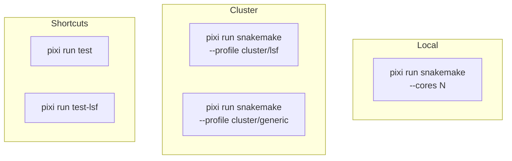

# Running the Pipeline

This guide covers different execution modes for the aa-tRNA-seq pipeline.

## Execution Modes



## Dry Run

Always start with a dry run to verify the DAG:

```bash
pixi run snakemake -n --configfile=config/config.yml
```

Or use the shortcut:

```bash
pixi run dry-run  # Uses config-test.yml
```

Expected output:

```
Building DAG of jobs...
Job stats:
job                      count
---------------------  -------
all                          1
stage_pod5                   2
rebasecall                   2
bwa_align                    2
classify_charging            2
get_cca_trna                 2
get_cca_trna_cpm             2
...
total                       XX
```

## Local Execution

### Basic Execution

```bash
pixi run snakemake --cores 12 --configfile=config/config.yml
```

### With Specific Rules

Run only specific rules:

```bash
# Run up to alignment
pixi run snakemake bwa_align --cores 12 --configfile=config/config.yml

# Run a single sample's outputs
pixi run snakemake results/myproject/bam/final/sample1.bam --cores 12 --configfile=config/config.yml
```

### Resource Limits

Limit resources for local execution:

```bash
pixi run snakemake --cores 8 --resources mem_mb=32000 gpu=1 \
    --configfile=config/config.yml
```

## Cluster Execution

### LSF Clusters

```bash
pixi run snakemake --profile cluster/lsf --configfile=config/config.yml
```

Or use the shortcut:

```bash
pixi run test-lsf  # Uses config-test.yml with LSF profile
```

### SLURM/Generic Clusters

```bash
pixi run snakemake --profile cluster/generic --configfile=config/config.yml
```

### Submit Script

For long-running jobs, use a submit script:

=== "run-myproject.sh"

    ```bash
    #!/bin/bash
    #BSUB -J aa-tRNA-seq
    #BSUB -o logs/pipeline.%J.out
    #BSUB -e logs/pipeline.%J.err
    #BSUB -q rna
    #BSUB -n 1
    #BSUB -R "rusage[mem=4000]"

    pixi run snakemake --profile cluster/lsf \
        --configfile=config/config-myproject.yml
    ```

Submit:

```bash
bsub < run-myproject.sh
```

## Monitoring Progress

### Snakemake Summary

```bash
pixi run snakemake --summary --configfile=config/config.yml
```

### Job Status

=== "LSF"

    ```bash
    bjobs -u $USER
    bjobs -l <job_id>  # Detailed status
    ```

=== "SLURM"

    ```bash
    squeue -u $USER
    scontrol show job <job_id>
    ```

### Log Files

Rule logs are stored in the output directory:

```bash
# List log files
ls results/myproject/logs/

# View specific rule log
cat results/myproject/logs/rebasecall/sample1.log
```

### Real-Time Progress

Watch Snakemake output:

```bash
# If running in foreground
# Progress is shown automatically

# If running via submit script
tail -f logs/pipeline.*.out
```

## Rerunning Failed Jobs

### Automatic Rerun

Snakemake automatically reruns failed jobs. Just rerun the same command:

```bash
pixi run snakemake --profile cluster/lsf --configfile=config/config.yml
```

### Force Rerun

Force rerun of specific rules:

```bash
# Rerun a specific rule for all samples
pixi run snakemake --forcerun classify_charging \
    --profile cluster/lsf --configfile=config/config.yml

# Rerun from a specific rule onwards
pixi run snakemake --forcerun classify_charging --forceall \
    --profile cluster/lsf --configfile=config/config.yml
```

### Rerun Single Sample

```bash
pixi run snakemake results/myproject/bam/final/sample1.bam \
    --forcerun --profile cluster/lsf --configfile=config/config.yml
```

## Advanced Options

### Unlock Directory

If a previous run was interrupted:

```bash
pixi run snakemake --unlock --configfile=config/config.yml
```

### Keep Going on Errors

Continue running independent jobs if some fail:

```bash
pixi run snakemake --keep-going --profile cluster/lsf \
    --configfile=config/config.yml
```

### Limit Concurrent Jobs

```bash
pixi run snakemake --jobs 50 --profile cluster/lsf \
    --configfile=config/config.yml
```

### Report Generation

Generate an HTML report after completion:

```bash
pixi run snakemake --report report.html --configfile=config/config.yml
```

## With Demultiplexing

For demultiplexed samples, ensure WarpDemuX is installed (`pixi run setup`), then run as usual:

```bash
# Dry run
pixi run snakemake -n --configfile=config/config-demux.yml

# Execute
pixi run snakemake --profile cluster/lsf \
    --configfile=config/config-demux.yml
```

## Pixi Task Shortcuts

| Command | Description |
|---------|-------------|
| `pixi run dry-run` | Dry run with test config |
| `pixi run test` | Local execution with test data (4 cores) |
| `pixi run test-lsf` | LSF execution with test data |
| `pixi run run-preprint` | Run preprint pipeline |
| `pixi run dag` | Generate workflow DAG image |

## Troubleshooting

### Pipeline Stuck

If the pipeline appears stuck:

1. Check cluster job status (`bjobs` or `squeue`)
2. Check for lock files: `ls .snakemake/locks/`
3. Unlock if needed: `pixi run snakemake --unlock`

### Out of Memory

Increase memory for specific rules in cluster profile. See [Cluster Setup](../cluster/lsf-setup.md).

### GPU Errors

Ensure GPU jobs are submitted to GPU queue. See [GPU Configuration](../cluster/gpu-configuration.md).

## Next Steps

- [Output Files](outputs.md) - Understand pipeline outputs
- [Cluster Setup](../cluster/lsf-setup.md) - Configure cluster profiles
- [Troubleshooting](../troubleshooting/common-errors.md) - Common issues
