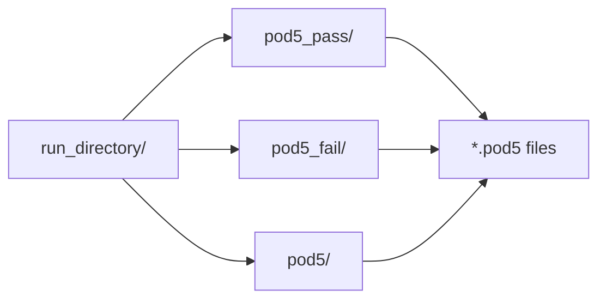
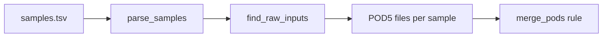
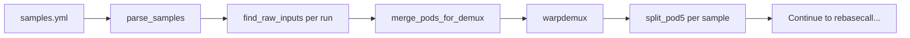

# Sample Files

The pipeline supports two sample file formats: TSV (simple) and YAML (with demultiplexing).

## TSV Format

Use TSV format for non-multiplexed samples:

```
sample_id<TAB>run_directory
```

### Example

=== "samples.tsv"

    ```
    sample1	/data/sequencing/run1
    sample2	/data/sequencing/run2
    sample1	/data/sequencing/run1_replicate
    ```

### Rules

- **No header row** - data starts on line 1
- **Tab-separated** - use actual tab characters, not spaces
- **Two columns**: sample ID and run directory path
- **Same sample ID** can appear multiple times - POD5 files are merged

### POD5 Discovery

The pipeline searches each run directory for POD5 files in:



All discovered POD5 files are merged per sample before processing.

## YAML Format

Use YAML format for multiplexed samples with barcode demultiplexing:

```yaml
runs:
  - path: /path/to/run
    barcode_kit: "kit_name"  # optional
    samples:
      sample_id: "barcode_name"
```

### Example

=== "samples.yml"

    ```yaml
    runs:
      # Pooled run with 4 barcoded samples
      - path: /data/sequencing/pooled_run1
        barcode_kit: "WDX4_tRNA_rna004_v1_0"
        samples:
          charged_rep1: "barcode03"
          uncharged_rep1: "barcode04"
          charged_rep2: "barcode05"
          uncharged_rep2: "barcode07"

      # Another pooled run (uses default barcode_kit from config)
      - path: /data/sequencing/pooled_run2
        samples:
          charged_rep3: "barcode03"
          uncharged_rep3: "barcode04"

      # Non-multiplexed run (skip demultiplexing)
      - path: /data/sequencing/direct_run
        samples:
          control_sample: ~
    ```

### Structure

| Field | Required | Description |
|-------|----------|-------------|
| `runs` | Yes | List of sequencing runs |
| `runs[].path` | Yes | Path to run directory |
| `runs[].barcode_kit` | No | Barcode kit (uses config default if omitted) |
| `runs[].samples` | Yes | Map of sample_id → barcode_name |

### Barcode Names

For WarpDemuX-tRNA kits:

| Kit | Available Barcodes |
|-----|-------------------|
| `WDX4_tRNA_rna004_v1_0` | barcode03, barcode04, barcode05, barcode07 |
| `WDX4b_tRNA_rna004_v1_0` | barcode04, barcode05, barcode07, barcode11 |

### Non-Multiplexed Samples in YAML

Use `~` (YAML null) for samples that don't need demultiplexing:

```yaml
runs:
  - path: /data/direct_sequencing
    samples:
      my_sample: ~  # No barcode, skip demux
```

## Data Flow

### Without Demultiplexing (TSV)



### With Demultiplexing (YAML)



## Validation

### Check Sample Detection

Run a dry-run to verify samples are detected:

```bash
pixi run snakemake -n --configfile=config/config.yml
```

Look for:

```
Building DAG of jobs...
Job stats:
job          count
---------  -------
merge_pods       3
...
```

The `merge_pods` count should match your number of samples.

### Common Issues

**No POD5 files found**

```
Error: No POD5 files found for sample 'sample1'
```

Verify:

1. Run directory path is correct
2. POD5 files exist in `pod5_pass/`, `pod5_fail/`, or `pod5/` subdirectory
3. Files have `.pod5` extension

**Sample not detected**

Check for:

- Extra whitespace in TSV file
- Wrong tab character (use actual tabs, not spaces)
- Missing YAML indentation

## Mixing Formats

You cannot mix TSV and YAML formats. Choose one based on your needs:

| Scenario | Format |
|----------|--------|
| Simple, non-multiplexed | TSV |
| Barcoded/pooled samples | YAML |
| Mix of multiplexed and direct | YAML (use `~` for direct) |

## Next Steps

- [Configuration](configuration.md) - Configure demultiplexing options
- [Running Pipeline](running-pipeline.md) - Execute the pipeline
- [Demultiplexing](../workflow/demultiplexing.md) - Detailed demux guide
