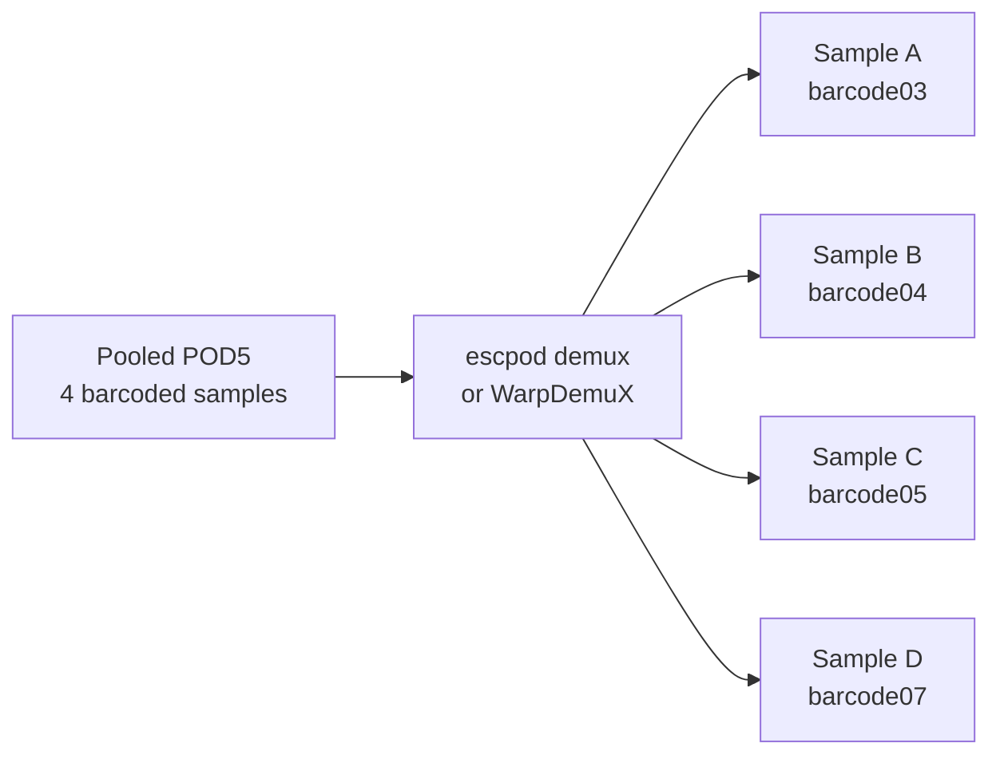

# Demultiplexing

Guide for signal-level barcode demultiplexing of pooled/multiplexed samples.

## Overview

The pipeline can split a pooled Nano-tRNAseq run into per-sample POD5 files based on
barcode signal patterns in the 5' adapter. Multiple samples can be sequenced together
and separated computationally.



Two backends are available, selected by `warpdemux.backend`:

| Backend | Implementation | Barcode model | Default |
|---------|----------------|---------------|---------|
| `escpod` | `escpod demux` (Rust), one fused pass | `barcode_wdx4_rna004` GBM | Yes |
| `warpdemux` | WarpDemuX python package + `escpod filter` | WarpDemuX tRNA kit (CatBoost) | No |

Both write the same downstream files, so everything after demultiplexing is
backend-agnostic:

- `demux/read_ids/{run_id}/barcode_mapping.tsv.gz` — per-read barcode assignment
- `demux/pod5/{sample}/{sample}.pod5` — per-sample POD5

!!! warning "The backends do not produce identical barcode calls"
    Barcode *numbering* is the same, but the models are different and the
    `unclassified` fraction differs sharply. Read
    [Choosing a Backend](#choosing-a-backend) before switching mid-project.

The config section is still named `warpdemux` for backward compatibility, even when the
`escpod` backend is used.

## When to Use Demultiplexing

Use demultiplexing when:

- Multiple samples were pooled in a single sequencing run
- Samples were prepared with WDX barcodes
- Using the Nano-tRNAseq protocol

Do **not** use when:

- Samples were sequenced individually (1 sample per run)
- Using Thomas splint adapter (incompatible)
- Barcodes were not used during library prep

## Choosing a Backend

### What the escpod backend actually runs

`escpod demux` **cannot load a WarpDemuX kit.** The tRNA kits
(`WDX4_tRNA_rna004_v1_0`, `WDX4b_tRNA_rna004_v1_0`) are
`warpdemux.models.fpt_boost.Fpt_Boost` objects wrapping a **CatBoost** classifier, and
every converter shipped with escapepod-rs requires either a scikit-learn `SVC` or a
scikit-learn `HistGradientBoostingClassifier`. Neither matches CatBoost, so conversion
is not possible.

The supported replacement is **`barcode_wdx4_rna004`**: a GBM *distilled* from the
`WDX4_tRNA_rna004_v1_0` teacher's high-confidence calls (confidence >= 0.9), trained and
served on the same Rust `--warpdemux-compat` fingerprint. It reports **0.971 balanced
recall** against that teacher (0.988 at 95% recovery), and its label mapping
(`{0:3, 1:4, 2:5, 3:7}`) is identical to the tRNA kit's — so barcode **numbering is
unchanged**. escpod labels barcodes `BC03` where the pipeline and its sample files use
`barcode03`; the pipeline translates between the two.

### Two semantic deltas you must know

1. **The `unclassified` fraction drops sharply.** The shipped GBM carries no per-class
   confidence thresholds, so escpod assigns every read with a usable adapter boundary to
   *some* barcode. WarpDemuX instead rejected low-confidence reads to `unclassified`. To
   restore WarpDemuX-like rejection, filter on the `confidence` column of the
   classifications table (`demux/escpod_output/{run_id}/classifications.csv`).
2. **`bc05` <-> `bc07` is the residual confusable pair.** Interpret differences between
   those two barcodes with extra care.

!!! warning "0.971 is teacher agreement, not ground truth"
    The 0.971 figure is agreement with the WarpDemuX teacher on held-out *confident*
    calls — not independent ground truth. Read-level concordance on real aa-tRNA-seq
    data has not been measured.

### Validating a backend switch

If you care about the exact read partition, run **both** backends on the same run and
compare the outputs. Copy your demux config, change `warpdemux.backend` and
`output_directory` in the copy, then run both:

```bash
# escpod backend (default)
pixi run snakemake --configfile=config/config-demux.yml --cores 12

# warpdemux backend, into a separate output directory
pixi run snakemake --configfile=config/config-demux-wdx.yml --cores 12
```

Compare `demux/read_ids/{run_id}/demux_summary.tsv.gz` (per-barcode counts) for a quick
check, and `demux/read_ids/{run_id}/barcode_mapping.tsv.gz` for per-read agreement.
`escapepod-rs` ships `scripts/compare_demux_results.py`, which produces a per-read
concordance table from two such runs.

### Job count

The escpod backend runs strictly fewer jobs: its fused pipeline
(detect → fingerprint → classify → split) emits per-read classifications *and* one POD5
per barcode in a single pass, so it needs neither `extract_sample_reads` nor
`split_pod5`.

### Boundary detection (`warpdemux.method`)

escpod-backend only. Selects how the adapter boundary is found before fingerprinting:

| Value | Notes |
|-------|-------|
| `cnn` (default) | Matches how the barcode model was trained. Requires `warpdemux.adapter_model` (ONNX). |
| `llr` | Needs no ONNX model, but agrees with the CNN only ~82% within +/-200 samples, which shifts calls. |

Because the barcode GBM was trained behind the CNN detector, `llr` is a train/serve
skew rather than a free choice.

## Setup

### 1. Install Tools and Models

```bash
pixi run setup
```

This builds the `escpod` CLI **with the demux feature** (source build, requires a Rust
toolchain >= 1.95 — the published escapepod-rs binaries are default-features only and do
not contain a working `escpod demux`), installs the escpod demux models, and installs
the python WarpDemuX package for the alternative backend.

The escpod barcode/adapter models can be installed on their own:

```bash
pixi run install-demux-models
```

This writes `barcode_wdx4_rna004.gbm.json` and `adapter_rna004.onnx` into
`resources/models/demux/` (gitignored), verifying sha256 against the upstream
`MANIFEST.json`. Models come from a local `rnabioco/escapepod-models` checkout
(`ESCAPEPOD_MODELS_DIR`, or a sibling directory of this repo) or, failing that, a GitHub
release.

!!! warning "Barcode models are not published as releases yet"
    Only `adapter_rna004@v1.0.1` is released on `rnabioco/escapepod-models`; the barcode
    GBM models are not. The local-checkout path is therefore currently required. The
    script prints the `scripts/release_model.sh` command needed to publish them.

### 2. Create YAML Sample File

Create a sample file in YAML format (required for demultiplexing):

=== "config/samples-demux.yml"

    ```yaml
    runs:
      # Pooled run with 4 barcoded samples
      - path: /data/sequencing/pooled_run
        barcode_kit: "WDX4_tRNA_rna004_v1_0"
        samples:
          charged_rep1: "barcode03"
          uncharged_rep1: "barcode04"
          charged_rep2: "barcode05"
          uncharged_rep2: "barcode07"
    ```

### 3. Enable in Configuration

Create a config file with demux enabled:

=== "config/config-demux.yml"

    ```yaml
    samples: config/samples-demux.yml
    output_directory: "results/demux"

    warpdemux:
        enabled: true
        backend: "escpod"                     # "escpod" (default) or "warpdemux"
        barcode_kit: "WDX4_tRNA_rna004_v1_0"  # warpdemux backend
        save_boundaries: true                 # warpdemux backend
        threads: 8

        # escpod backend only
        method: "cnn"
        barcode_model: "resources/models/demux/barcode_wdx4_rna004.gbm.json"
        adapter_model: "resources/models/demux/adapter_rna004.onnx"
    ```

## Barcode Kits

[WarpDemuX](https://github.com/KleistLab/WarpDemuX) provides adapter-based barcode demultiplexing for Oxford Nanopore direct RNA sequencing. The `warpdemux` backend uses the tRNA-specific WarpDemuX models trained for the Nano-tRNAseq protocol; the `escpod` backend uses a GBM distilled from `WDX4_tRNA_rna004_v1_0` that keeps the same barcode numbering (see [Choosing a Backend](#choosing-a-backend)).

### Naming Convention

Model names follow the format: `WDX[n_barcodes][alt_set]_tRNA_rna004_v1_0`

- **`WDX`** — WarpDemuX prefix
- **`[n_barcodes]`** — number of barcodes in the set (e.g., `4`)
- **`[alt_set]`** — optional letter for alternative adapter sets (e.g., `b`)
- **`_tRNA_`** — indicates tRNA-specific model
- **`rna004_v1_0`** — ONT RNA004 chemistry version

### Available Kits

| Kit | # Barcodes | Barcode IDs | Notes |
|-----|------------|-------------|-------|
| `WDX4_tRNA_rna004_v1_0` | 4 | barcode03, barcode04, barcode05, barcode07 | **Recommended**, +3-7% recovery |
| `WDX4b_tRNA_rna004_v1_0` | 4 | barcode04, barcode05, barcode07, barcode11 | Alternative adapter set |

!!! note "escpod backend"
    `barcode_kit` is only read by the `warpdemux` backend. The escpod backend loads
    `warpdemux.barcode_model` instead; the shipped `barcode_wdx4_rna004` GBM covers the
    same four barcodes as `WDX4_tRNA_rna004_v1_0` (03, 04, 05, 07). There is no escpod
    equivalent of `WDX4b_tRNA_rna004_v1_0` — use `backend: warpdemux` for that kit.

!!! info "Standard RNA004 Models"
    WarpDemuX also offers standard RNA004 models (WDX4, WDX6, WDX10) for mRNA and other direct RNA applications. See the [WarpDemuX README](https://github.com/KleistLab/WarpDemuX) for details. This pipeline requires the **`_tRNA_`** variants.

!!! warning "Protocol Compatibility"
    WarpDemuX-tRNA models are developed specifically for the **Nano-tRNAseq protocol**. They do **NOT** work with data using the Thomas splint adapter.

## Sample File Format

### YAML Structure

```yaml
runs:
  - path: /path/to/run           # Run directory
    barcode_kit: "kit_name"      # Optional, uses config default
    samples:
      sample_name: "barcode_id"  # Map sample to barcode
```

### Multiple Runs

```yaml
runs:
  # First pooled run
  - path: /data/run1
    samples:
      sample1: "barcode03"
      sample2: "barcode04"

  # Second pooled run
  - path: /data/run2
    samples:
      sample3: "barcode03"
      sample4: "barcode04"
```

### Mixed Runs (Demux + Direct)

```yaml
runs:
  # Pooled run
  - path: /data/pooled_run
    samples:
      pooled_sample1: "barcode03"
      pooled_sample2: "barcode04"

  # Direct sequencing (no demux)
  - path: /data/direct_run
    samples:
      direct_sample: ~  # null = skip demux
```

## Dual Barcoding (WDX + EDX)

The pipeline supports **dual barcoding** — combining WDX (5' signal-based) and EDX (3' adapter sequence-based) barcodes for two-axis demultiplexing.

- **WDX**: 5' signal barcode predicted from the raw nanopore signal by the configured demux backend (`escpod demux` or WarpDemuX). This is the primary demultiplexing barcode used to split POD5 reads into samples.
- **EDX**: 3' adapter sequence variant (e.g., `edx01`, `edx02`). Different adapter sequences at the 3' end identify which adapter was used during library prep. EDX filtering happens **early** — right after basecalling, before alignment — so downstream rules only process matching reads.

### When to Use Dual Barcoding

Use dual barcoding when samples are multiplexed with **both** WDX adapters at the 5' end **and** different EDX adapter sequences at the 3' end. This enables true two-axis demultiplexing: WDX splits reads at the POD5 level, then EDX splits both FASTQ and POD5 before alignment based on 3' adapter identity. An optional concordance analysis can verify agreement between the two axes.

### Dict Format for Samples

When using dual barcoding, specify sample values as a dict with `wdx` and `edx` keys instead of a plain barcode string. The `edx` value must match a name from `adapters.three_prime` in the config (e.g., `edx01`, `edx02`):

```yaml
runs:
  - path: /data/pooled_run
    barcode_kit: "WDX4_tRNA_rna004_v1_0"
    samples:
      # Dict format: wdx + edx
      # edx values must match adapter names from adapters.three_prime config
      sample_bc03:
        wdx: "barcode03"
        edx: "edx01"
      sample_bc04:
        wdx: "barcode04"
        edx: "edx02"
```

### EDX Early Splitting

When a sample has an `edx` assignment, the pipeline detects 3' adapter identity on the unaligned BAM right after basecalling, then splits both FASTQ and POD5 by adapter **before alignment**. This avoids redundant processing when two samples share a WDX barcode but have different EDX adapters.

The EDX splitting flow:

```
rebasecall → uBAM → detect_edx_adapters → extract_edx_read_ids
                                            ├── filter_fastq_by_edx → bwa_align → ...
                                            └── filter_pod5_by_edx → classify_charging
```

Reads with no detected 3' adapter get `"none"` in the adapter detection TSV and are excluded from all samples. For samples without an `edx` assignment, the pipeline flow is unchanged.

### EDX Concordance Output (QC)

When samples have EDX assignments and `edx.enabled: true`, the `edx_concordance` rule produces a QC concordance table at `summary/edx/edx_concordance.tsv.gz`. This table shows how reads assigned to each WDX sample distribute across EDX adapter identities, useful for verifying demultiplexing accuracy. The concordance is computed from the pre-alignment adapter detection TSVs (which contain ALL reads), not from final BAMs.

**Output columns:**

| Column | Description |
|--------|-------------|
| `sample` | WDX sample name |
| `edx_adapter` | 3' adapter identity detected (e.g., `edx01`, `edx02`, `none`) |
| `n_reads` | Number of reads with this adapter |
| `pct` | Percentage of the sample's reads with this adapter |

!!! tip "Enable EDX concordance"
    EDX concordance output requires `edx.enabled: true` in the pipeline config. The rule runs automatically when enabled and at least one sample has an `edx` assignment.

!!! tip "Debugging unmatched reads"
    The full adapter detection TSV at `demux/edx/{sample}/{sample}.edx_adapters.tsv.gz` records every read's adapter assignment including `"none"`, useful for debugging.

## Pipeline Flow

With demultiplexing enabled, the pipeline adds these steps before standard processing.

=== "escpod backend (default)"

    ```mermaid
    flowchart TB
        subgraph Input
            A[Pooled POD5 files]
        end

        subgraph Demux[Demultiplexing Steps]
            B[escpod_demux<br/>Classify + split in one pass]
            C[parse_escpod_demux<br/>Mapping + summary]
            D[collect_escpod_pod5<br/>Symlink per-sample POD5]
        end

        subgraph Standard[Standard Pipeline]
            F[rebasecall]
            G[bwa_align]
            H[classify_charging]
            I[...]
        end

        A --> B --> C
        B --> D --> F --> G --> H --> I
    ```

=== "warpdemux backend"

    ```mermaid
    flowchart TB
        subgraph Input
            A[Pooled POD5 files]
        end

        subgraph Demux[Demultiplexing Steps]
            B[warpdemux<br/>Predict barcodes]
            C[parse_warpdemux<br/>Create mapping]
            D[extract_sample_reads<br/>Filter by barcode]
            E[split_pod5<br/>escpod filter per sample]
        end

        subgraph Standard[Standard Pipeline]
            F[rebasecall]
            G[bwa_align]
            H[classify_charging]
            I[...]
        end

        A --> B --> C --> D --> E --> F --> G --> H --> I
    ```

Rule files: `demux.smk` holds the backend dispatch plus the EDX rules below;
`demux-escpod.smk` and `demux-warpdemux.smk` hold the backend-specific rules and only
one is included per run.

## Demux Rules (escpod backend)

### escpod_demux

Classifies barcodes and splits POD5s in one pass over the raw signal
(detect → fingerprint → classify → split).

| Property | Value |
|----------|-------|
| Input | Raw POD5 files from run directory, `warpdemux.barcode_model` |
| Output | `demux/escpod_output/{run_id}/` (one `barcode_BC*.pod5` per class) and `classifications.csv` |
| Threads | `warpdemux.threads` (8 in config-base; 16 if unset) |

### parse_escpod_demux

Converts the escpod classifications CSV to the pipeline's barcode mapping table,
renaming escpod's `BC03` labels to `barcode03`. Reads with no usable adapter boundary
become `unclassified`.

| Property | Value |
|----------|-------|
| Input | `demux/escpod_output/{run_id}/classifications.csv` |
| Output | `demux/read_ids/{run_id}/barcode_mapping.tsv.gz`, `demux/read_ids/{run_id}/demux_summary.tsv.gz` |

### collect_escpod_pod5

Symlinks the per-barcode POD5 that `escpod_demux` already wrote into the per-sample
path — no second filter pass. Fails with a pointer to `warpdemux.barcode_model` if the
sample's barcode is not one of the model's classes.

| Property | Value |
|----------|-------|
| Input | `demux/escpod_output/{run_id}/` |
| Output | `demux/pod5/{sample}/{sample}.pod5` (symlink) |

## Demux Rules (warpdemux backend)

### warpdemux

Runs WarpDemuX barcode prediction directly on raw POD5 files.

| Property | Value |
|----------|-------|
| Input | Raw POD5 files from run directory |
| Output | `demux/warpdemux_output/{run_id}/` |
| Threads | `warpdemux.threads` (8 in config-base; 16 if unset) |

### parse_warpdemux

Parses WarpDemuX predictions to create barcode mapping.

| Property | Value |
|----------|-------|
| Input | WarpDemuX output directory |
| Output | `demux/read_ids/{run_id}/barcode_mapping.tsv.gz`, `demux/read_ids/{run_id}/demux_summary.tsv.gz` |

### extract_sample_reads

Extracts read IDs for a specific sample's barcode.

| Property | Value |
|----------|-------|
| Input | Barcode mapping file |
| Output | `demux/read_ids/{sample}/{sample}.txt` |

### split_pod5

Filters raw POD5 files by sample using the read ID list, with `escpod filter`.

| Property | Value |
|----------|-------|
| Input | Run directory, read ID list |
| Output | `demux/pod5/{sample}/{sample}.pod5` |

!!! note "`escpod filter` takes a single input"
    `escpod filter` accepts one positional input — a file, or a directory it walks
    recursively — so the rule passes the **run root** rather than a list of
    `pod5_pass`/`pod5_fail`/`pod5` directories. Reads outside the ID list are dropped
    regardless, so the wider scan only costs walk time. There is no `--missing-ok` flag
    (read IDs absent from the input are a warning, not an error), and an **empty read-ID
    file is a hard error** — a barcode matching zero reads fails this job rather than
    silently producing an empty POD5.

## Barcode Mapping Output

Both backends write `demux/read_ids/{run_id}/barcode_mapping.tsv.gz`:

| Column | Description |
|--------|-------------|
| read_id | Nanopore read identifier |
| predicted_barcode | Assigned barcode (e.g., `barcode03`) or `unclassified` |

and the per-barcode summary `demux/read_ids/{run_id}/demux_summary.tsv.gz`, which is a
first-class pipeline output whenever demux is enabled (it is never cleaned up):

| Column | Description |
|--------|-------------|
| predicted_barcode | Barcode (or `unclassified`) |
| n_reads | Reads assigned |
| mean_confidence | Mean classifier confidence (escpod backend only) |

## EDX Rules

### detect_edx_adapters

Detects 3' adapter identity per read on the unaligned BAM (before alignment). Produces a gzipped TSV mapping each read_id to its best-matching 3' adapter name. Only runs for samples with an `edx` assignment.

| Property | Value |
|----------|-------|
| Input | Rebasecalled uBAM |
| Output | `demux/edx/{sample}/{sample}.edx_adapters.tsv.gz` |
| Script | `workflow/scripts/detect_3p_adapters.py` |

### extract_edx_read_ids

Extracts read IDs matching the sample's expected EDX adapter from the detection TSV.

| Property | Value |
|----------|-------|
| Input | Adapter detection TSV |
| Output | `demux/edx/{sample}/{sample}.edx_read_ids.txt` |

### filter_fastq_by_edx

Extracts FASTQ for reads matching the sample's EDX adapter from the uBAM.

| Property | Value |
|----------|-------|
| Input | Rebasecalled uBAM + read IDs |
| Output | `demux/edx/fq/{sample}/{sample}.fq.gz` |

### filter_pod5_by_edx

Filters POD5 to keep only reads matching the sample's EDX adapter, with `escpod filter`.

| Property | Value |
|----------|-------|
| Input | WDX-split (or merged) POD5 + read IDs |
| Output | `demux/edx/pod5/{sample}/{sample}.pod5` |

An EDX adapter that matches zero reads produces an empty read-ID file, which
`escpod filter` rejects as a hard error ("No read IDs found"). This is intentional: the
job fails instead of writing an empty POD5 that downstream rules would silently
process.

### edx_concordance

Builds a concordance table of WDX sample assignment vs EDX (3' adapter) identity. Uses pre-alignment adapter detection TSVs (which contain ALL reads) rather than final BAMs. Only runs when `edx.enabled: true` and samples have EDX assignments.

| Property | Value |
|----------|-------|
| Input | Adapter detection TSVs for all EDX-assigned samples |
| Output | `summary/edx/edx_concordance.tsv.gz` |
| Script | `workflow/scripts/edx_concordance.py` |

## Running

### Dry Run

```bash
pixi run snakemake -n --configfile=config/config-demux.yml
```

### Execute

```bash
# Local
pixi run snakemake --cores 12 --configfile=config/config-demux.yml

# Cluster
pixi run snakemake --profile cluster/lsf --configfile=config/config-demux.yml
```

## Output Structure

With demultiplexing, outputs include:

```
{output_directory}/
├── demux/
│   ├── escpod_output/{run_id}/     # escpod backend
│   │   ├── barcode_BC*.pod5        #   one POD5 per barcode class
│   │   └── classifications.csv     #   per-read barcode + confidence
│   ├── warpdemux_output/{run_id}/  # warpdemux backend
│   │   └── warpdemux_*/            #   WarpDemuX results
│   ├── read_ids/
│   │   ├── {run_id}/
│   │   │   ├── barcode_mapping.tsv.gz
│   │   │   └── demux_summary.tsv.gz
│   │   └── {sample}/{sample}.txt   # Per-sample WDX read IDs (warpdemux backend)
│   ├── pod5/
│   │   └── {sample}/{sample}.pod5  # Per-sample WDX POD5 (symlink on escpod backend)
│   └── edx/                        # EDX early splitting (if edx assigned)
│       ├── {sample}/
│       │   ├── {sample}.edx_adapters.tsv.gz  # All reads → adapter mapping
│       │   └── {sample}.edx_read_ids.txt     # Matching read IDs
│       ├── fq/{sample}/
│       │   └── {sample}.fq.gz      # EDX-filtered FASTQ
│       └── pod5/{sample}/
│           └── {sample}.pod5       # EDX-filtered POD5
├── bam/
│   └── ...                         # Standard outputs
└── summary/
    ├── edx/
    │   └── edx_concordance.tsv.gz  # EDX concordance (if edx.enabled)
    └── ...                         # Standard outputs
```

## Configuration Options

```yaml
warpdemux:
    enabled: true                        # Enable/disable demux
    backend: "escpod"                    # "escpod" or "warpdemux"
    barcode_kit: "WDX4_tRNA_rna004_v1_0" # Default kit (warpdemux backend)
    save_boundaries: true                # Save boundary info (warpdemux backend)
    threads: 8                           # Worker threads
    method: "cnn"                        # Boundary detection (escpod backend)
    barcode_model: "resources/models/demux/barcode_wdx4_rna004.gbm.json"
    adapter_model: "resources/models/demux/adapter_rna004.onnx"
```

| Option | Description | Default | Backend |
|--------|-------------|---------|---------|
| `enabled` | Enable demultiplexing | `false` | both |
| `backend` | `escpod` or `warpdemux` | `escpod` | both |
| `threads` | Worker threads | `8` (config default; rules fall back to 16) | both |
| `barcode_kit` | Default WarpDemuX kit | `WDX4_tRNA_rna004_v1_0` | warpdemux |
| `save_boundaries` | Save demux boundaries | `true` | warpdemux |
| `method` | Adapter-boundary detector: `cnn` or `llr` | `cnn` | escpod |
| `barcode_model` | Barcode GBM JSON (required) | `resources/models/demux/barcode_wdx4_rna004.gbm.json` | escpod |
| `adapter_model` | Boundary ONNX model (required for `method: cnn`) | `resources/models/demux/adapter_rna004.onnx` | escpod |

## Troubleshooting

### No Reads for Sample

If a sample has zero reads after demux:

1. Check barcode assignment in sample file
2. Verify barcode kit matches library prep
3. Check `demux_summary.tsv.gz` for barcode distribution

```bash
zcat results/demux/read_ids/{run_id}/demux_summary.tsv.gz
```

A barcode matching zero reads is now a **hard failure** on the warpdemux backend:
`split_pod5` calls `escpod filter`, which rejects an empty read-ID file with
"No read IDs found" rather than writing an empty POD5. Fix the barcode assignment (or
drop the sample) rather than expecting an empty output.

### WarpDemuX Fails

Common issues:

- **Memory**: Increase `mem_mb` in cluster profile for `warpdemux` rule
- **Model not found**: Verify `barcode_kit` name is correct
- **Incompatible data**: WarpDemuX-tRNA only works with Nano-tRNAseq protocol

### `escpod demux` Unavailable

```
error: unrecognized subcommand 'demux'
```

or an `onstart` warning that `'escpod demux' is unavailable`. The installed `escpod` was
built with default features only (this includes every published escapepod-rs release
binary). Rebuild from source:

```bash
pixi run install-escpod   # builds with --features cnn-detect
```

Or fall back to `warpdemux.backend: "warpdemux"`.

### Barcode Model Not Found

```
warpdemux.barcode_model is not set. Run 'bash scripts/install-demux-models.sh' and check config.
```

or a missing `resources/models/demux/barcode_wdx4_rna004.gbm.json`. Install the models:

```bash
pixi run install-demux-models
```

Because the barcode GBMs are not published as releases yet, you will need a local
`rnabioco/escapepod-models` checkout (`ESCAPEPOD_MODELS_DIR=/path/to/escapepod-models`,
or a sibling directory of this repo). With `warpdemux.method: cnn` the boundary model
`adapter_rna004.onnx` is required as well; `method: llr` needs no ONNX model but shifts
barcode calls.

### Unclassified Fraction Dropped After Switching to escpod

Expected. The shipped GBM has no per-class confidence thresholds, so escpod assigns
every read with a usable adapter boundary to a barcode, whereas WarpDemuX rejected
low-confidence reads. To recover WarpDemuX-like rejection, filter on the `confidence`
column of `demux/escpod_output/{run_id}/classifications.csv` (and check
`mean_confidence` per barcode in `demux_summary.tsv.gz`).

### Unbalanced Barcodes

If barcode distribution is very unbalanced:

1. Check library prep QC
2. Review loading concentrations
3. Consider if samples have different RNA amounts

## Best Practices

1. **Verify barcode distribution** before running full pipeline:
   ```bash
   pixi run snakemake demux/read_ids/{run_id}/demux_summary.tsv.gz \
       --configfile=config/config-demux.yml
   ```

2. **Use recommended kit** (`WDX4_tRNA_rna004_v1_0`) for best recovery, or its distilled
   escpod equivalent `barcode_wdx4_rna004`

3. **Check sample file format** carefully - YAML indentation matters

4. **Monitor memory** - WarpDemuX can require 32GB+ for large runs

5. **Do not switch backends mid-project.** The two produce different barcode partitions.
   If you must switch, re-demultiplex every run in the comparison and validate as
   described in [Choosing a Backend](#choosing-a-backend)
