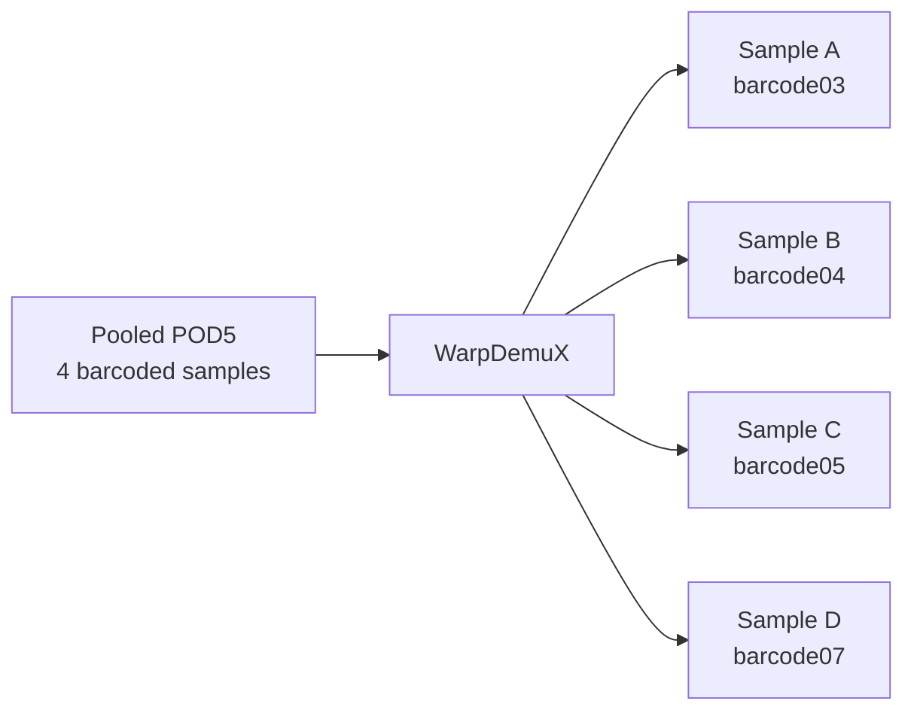
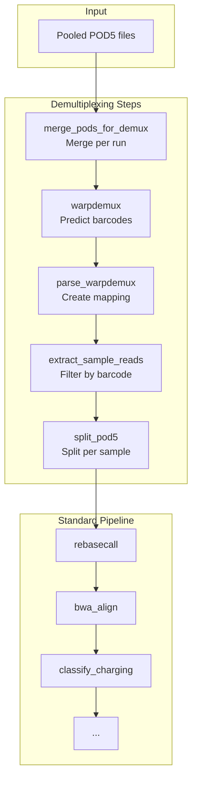

# Demultiplexing

Guide for using WarpDemuX barcode demultiplexing with pooled/multiplexed samples.

## Overview

WarpDemuX enables barcode demultiplexing for pooled Nano-tRNAseq sequencing runs. Multiple samples can be sequenced together and separated computationally based on barcode signal patterns.



## When to Use Demultiplexing

Use WarpDemuX when:

- Multiple samples were pooled in a single sequencing run
- Samples were prepared with WarpDemuX barcodes
- Using the Nano-tRNAseq protocol

Do **not** use when:

- Samples were sequenced individually (1 sample per run)
- Using Thomas splint adapter (incompatible)
- Barcodes were not used during library prep

## Setup

### 1. Install Demux Environment

```bash
pixi install -e demux
pixi run -e demux install-warpdemux
```

This installs the WarpDemuX package and its dependencies.

### 2. Create YAML Sample File

Create a sample file in YAML format (required for demultiplexing):

=== "config/samples-demux.yml"

    ```yaml
    runs:
      # Pooled run with 4 barcoded samples
      - path: /data/sequencing/pooled_run
        barcode_kit: "WDX4_tRNA_rna004_v1_0"
        samples:
          charged_rep1: "barcode03"
          uncharged_rep1: "barcode04"
          charged_rep2: "barcode05"
          uncharged_rep2: "barcode07"
    ```

### 3. Enable in Configuration

Create a config file with demux enabled:

=== "config/config-demux.yml"

    ```yaml
    samples: config/samples-demux.yml
    output_directory: "results/demux"

    warpdemux:
        enabled: true
        barcode_kit: "WDX4_tRNA_rna004_v1_0"
        save_boundaries: true
        threads: 8
    ```

## Barcode Kits

### Available Kits

| Kit | Barcodes | Notes |
|-----|----------|-------|
| `WDX4_tRNA_rna004_v1_0` | barcode03, barcode04, barcode05, barcode07 | **Recommended** |
| `WDX4b_tRNA_rna004_v1_0` | barcode04, barcode05, barcode07, barcode11 | Alternative |

### Performance

`WDX4_tRNA_rna004_v1_0` provides +3-7% improved read recovery compared to `WDX4b_tRNA_rna004_v1_0`.

!!! warning "Protocol Compatibility"
    WarpDemuX-tRNA models are developed specifically for the **Nano-tRNAseq protocol**. They do **NOT** work with data using the Thomas splint adapter.

## Sample File Format

### YAML Structure

```yaml
runs:
  - path: /path/to/run           # Run directory
    barcode_kit: "kit_name"      # Optional, uses config default
    samples:
      sample_name: "barcode_id"  # Map sample to barcode
```

### Multiple Runs

```yaml
runs:
  # First pooled run
  - path: /data/run1
    samples:
      sample1: "barcode03"
      sample2: "barcode04"

  # Second pooled run
  - path: /data/run2
    samples:
      sample3: "barcode03"
      sample4: "barcode04"
```

### Mixed Runs (Demux + Direct)

```yaml
runs:
  # Pooled run
  - path: /data/pooled_run
    samples:
      pooled_sample1: "barcode03"
      pooled_sample2: "barcode04"

  # Direct sequencing (no demux)
  - path: /data/direct_run
    samples:
      direct_sample: ~  # null = skip demux
```

## Pipeline Flow

With demultiplexing enabled, the pipeline adds these steps before standard processing:



## Demux Rules

### merge_pods_for_demux

Merges POD5 files **per run** (not per sample) for demultiplexing.

| Property | Value |
|----------|-------|
| Input | All POD5s from run directory |
| Output | `demux/merged/{run_id}/{run_id}.pod5` |
| Threads | 12 |

### warpdemux

Runs WarpDemuX barcode prediction.

| Property | Value |
|----------|-------|
| Input | Merged run POD5 |
| Output | `demux/warpdemux_output/{run_id}/` |
| Threads | Configurable (default: 8) |

### parse_warpdemux

Parses WarpDemuX predictions to create barcode mapping.

| Property | Value |
|----------|-------|
| Input | WarpDemuX output directory |
| Output | `demux/read_ids/{run_id}/barcode_mapping.tsv.gz` |

**Output format:**

| Column | Description |
|--------|-------------|
| read_id | Nanopore read identifier |
| predicted_barcode | Assigned barcode (e.g., "barcode03") |

### extract_sample_reads

Extracts read IDs for a specific sample's barcode.

| Property | Value |
|----------|-------|
| Input | Barcode mapping file |
| Output | `demux/read_ids/{sample}.txt` |

### split_pod5

Splits merged POD5 by sample using read ID list.

| Property | Value |
|----------|-------|
| Input | Merged run POD5, read ID list |
| Output | `demux/pod5/{sample}.pod5` |

## Running

### Dry Run

```bash
pixi run -e demux snakemake -n --configfile=config/config-demux.yml
```

### Execute

```bash
# Local
pixi run -e demux snakemake --cores 12 --configfile=config/config-demux.yml

# Cluster
pixi run -e demux snakemake --profile cluster/lsf --configfile=config/config-demux.yml
```

## Output Structure

With demultiplexing, outputs include:

```
{output_directory}/
├── demux/
│   ├── merged/{run_id}/
│   │   └── {run_id}.pod5           # Merged per-run POD5
│   ├── warpdemux_output/{run_id}/
│   │   └── warpdemux_*/            # WarpDemuX results
│   ├── read_ids/
│   │   ├── {run_id}/
│   │   │   ├── barcode_mapping.tsv.gz
│   │   │   └── demux_summary.tsv.gz
│   │   └── {sample}.txt            # Per-sample read IDs
│   └── pod5/
│       └── {sample}.pod5           # Per-sample POD5
├── bam/
│   └── ...                         # Standard outputs
└── summary/
    └── ...                         # Standard outputs
```

## Configuration Options

```yaml
warpdemux:
    enabled: true                        # Enable/disable demux
    barcode_kit: "WDX4_tRNA_rna004_v1_0" # Default kit
    save_boundaries: true                # Save boundary info
    threads: 8                           # Worker threads
```

| Option | Description | Default |
|--------|-------------|---------|
| `enabled` | Enable demultiplexing | `false` |
| `barcode_kit` | Default barcode kit | `WDX4_tRNA_rna004_v1_0` |
| `save_boundaries` | Save demux boundaries | `true` |
| `threads` | WarpDemuX threads | `8` |

## Troubleshooting

### No Reads for Sample

If a sample has zero reads after demux:

1. Check barcode assignment in sample file
2. Verify barcode kit matches library prep
3. Check `demux_summary.tsv.gz` for barcode distribution

```bash
zcat results/demux/read_ids/{run_id}/demux_summary.tsv.gz
```

### WarpDemuX Fails

Common issues:

- **Memory**: Increase `mem_mb` in cluster profile for `warpdemux` rule
- **Model not found**: Verify `barcode_kit` name is correct
- **Incompatible data**: WarpDemuX-tRNA only works with Nano-tRNAseq protocol

### Unbalanced Barcodes

If barcode distribution is very unbalanced:

1. Check library prep QC
2. Review loading concentrations
3. Consider if samples have different RNA amounts

## Best Practices

1. **Verify barcode distribution** before running full pipeline:
   ```bash
   pixi run -e demux snakemake demux/read_ids/{run_id}/demux_summary.tsv.gz \
       --configfile=config/config-demux.yml
   ```

2. **Use recommended kit** (`WDX4_tRNA_rna004_v1_0`) for best recovery

3. **Check sample file format** carefully - YAML indentation matters

4. **Monitor memory** - WarpDemuX can require 32GB+ for large runs
