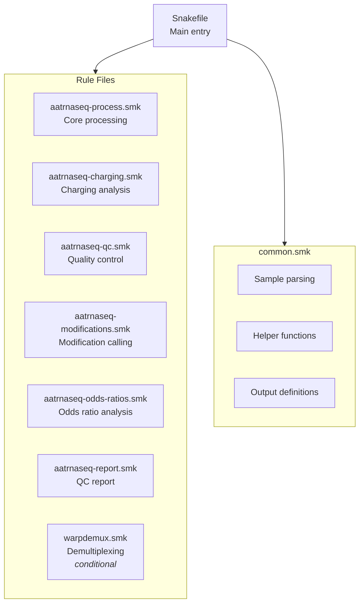
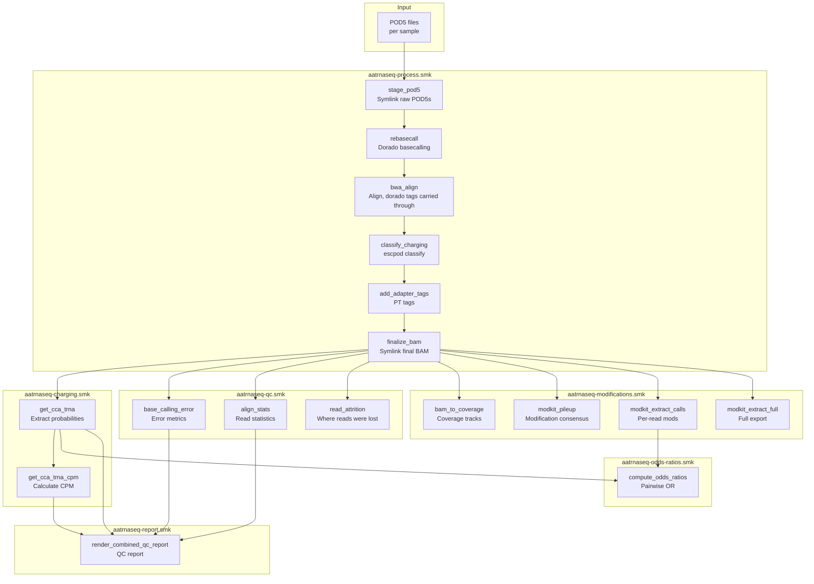
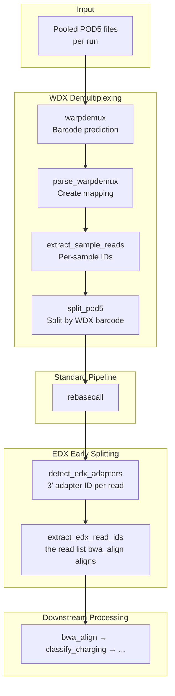

# Workflow Overview

This page provides a high-level view of the aa-tRNA-seq pipeline architecture and data flow.

## Pipeline Architecture

The pipeline is organized into modular Snakemake rule files:



## Complete Pipeline Flow

### Standard Pipeline (No Demultiplexing)



### With Demultiplexing (WarpDemuX + EDX)



## Rule Categories

### Processing Rules

Core data processing from raw signal to classified reads:

| Rule | Purpose | GPU |
|------|---------|-----|
| `stage_pod5` | Symlink a sample's raw POD5 files into one directory | No |
| `rebasecall` | Basecall with Dorado | Yes |
| `bwa_idx` | Build BWA index | No |
| `bwa_align` | Align reads to reference, carrying dorado's tags through | No |
| `classify_charging` | ML charging classification (`escpod classify`) | No |
| `add_adapter_tags` | Add PT tags for adapter positions | No |
| `finalize_bam` | Symlink final BAM | No |

### Charging Analysis Rules

Extract and summarize charging classification:

| Rule | Purpose |
|------|---------|
| `get_cca_trna` | Extract per-read charging scores |
| `get_cca_trna_cpm` | Calculate CPM-normalized counts |

### Quality Control Rules

Generate QC metrics and statistics:

| Rule | Purpose |
|------|---------|
| `compute_reference_similarity` | Pairwise reference sequence similarity matrix |
| `base_calling_error` | Per-position error frequencies |
| `align_stats` | Read counts through pipeline |
| `anchor_coverage` | How many aligned reads span the CCA anchor |
| `read_attrition` | Where the run's reads were lost, as one table |

### Modification Rules

RNA modification calling with Modkit:

| Rule | Purpose |
|------|---------|
| `bam_to_coverage` | Generate coverage tracks |
| `modkit_pileup` | Per-site modification consensus |
| `modkit_extract_calls` | Per-read modification calls |
| `modkit_extract_full` | Comprehensive modification export |

### Odds Ratio Rules

Per-tRNA pairwise modification odds ratios:

| Rule | Purpose |
|------|---------|
| `compute_odds_ratios` | Pairwise modification odds ratios per tRNA |

### Report Rules

QC report generation:

| Rule | Purpose |
|------|---------|
| `render_combined_qc_report` | Combined Quarto QC report with per-sample tabs |

### Demultiplexing Rules

Optional WarpDemuX barcode demultiplexing:

| Rule | Purpose |
|------|---------|
| `warpdemux` | Run WDX barcode prediction |
| `parse_warpdemux` | Parse predictions to mapping |
| `extract_sample_reads` | Filter reads by WDX barcode |
| `split_pod5` | Create per-sample WDX POD5s |
| `detect_edx_adapters` | Detect 3' adapter identity per read |
| `extract_edx_read_ids` | Extract matching read IDs for EDX (bwa_align aligns only these) |
| `edx_concordance` | WDX vs EDX concordance table |

## Key Processing Steps

### 1. POD5 Merging

Individual POD5 files from a sequencing run are merged into a single file per sample:

```
run1/pod5_pass/*.pod5  ─┐
run1/pod5_fail/*.pod5  ─┼──► sample.pod5
run2/pod5/*.pod5       ─┘
```

### 2. Basecalling

Dorado re-basecalls with:

- Move tables (`--emit-moves`) required by the charging model
- Modification calling (`--modified-bases pseU m5C inosine_m6A`)
- High-accuracy model (rna004_sup@v6.0.0)

### 3. Alignment

BWA MEM with RNA-optimized parameters:

- `-x ont2d` preset for ONT reads
- `-F 20`: Unmapped and reverse-strand read removal

### 4. Charging Classification

`escpod classify` analyzes signal at the CCA 3' end:

- Input: POD5 (signal) + aligned BAM (with move tables) + reference + model bundle
- Output: the same BAM records with a `cl` tag (0-255 score) added
- Threshold: ≥200 = charged (the bundle's own recommended operating point)

!!! warning "Reads with no `cl` tag are no-calls, not uncharged"

    The model abstains on reads whose common arm did not align, emitting no tag
    rather than a default class. Abstention is charging-correlated, so a
    charging fraction over called reads alone is an **underestimate** — the
    per-read reasons are in `{sample}.charging_calls.tsv.gz` and the run-level
    rate in `read_attrition.tsv.gz`.

!!! info "Charging Classification Details"

    A few notes about charging classification for charged vs. uncharged tRNA reads:

    1. This step retains only full-length tRNA reads (with an allowance for signal loss at the 5' end of nanopore direct RNA sequencing)

    2. The current approach does not rely on differences in adapter sequences attached to charged vs. uncharged tRNA molecules (though these sequences are retained as separate entries in the alignment reference). The pipeline relies exclusively on signal data over a **6-nucleotide modification kmer** spanning the universal CCA 3' end of tRNA and the first three nucleotides of the 3' adapter (**CCAGGC**) to distinguish charged and uncharged reads.

### 5. Adapter Position Tagging

The `add_adapter_tags` rule adds PT tags with adapter boundaries:

- Uses parasail Smith-Waterman alignment
- Detects 5' and 3' adapter positions
- Can infer 5' adapter from alignment position when truncated

## Resource Requirements

### GPU Rules

These rules require GPU access:

| Rule | Typical Runtime | Memory |
|------|-----------------|--------|
| `rebasecall` | 30-60 min/sample | 24 GB |

### CPU-Intensive Rules

| Rule | Threads | Memory |
|------|---------|--------|
| `bwa_align` | 16 | 160 GB (see `cluster/slurm/config.yaml`) |
| `classify_charging` | 8 | 24 GB |
| `modkit_extract_full` | 12 | 48 GB |

### Memory-Intensive Rules

| Rule | Memory |
|------|--------|
| `modkit_extract_calls` | 96 GB |
| `warpdemux` | 32 GB |

## Configuration Points

Key parameters that affect pipeline behavior:

| Parameter | Affects |
|-----------|---------|
| `opts.dorado` | Basecalling modifications |
| `opts.bwa` | Alignment sensitivity |
| `opts.bam_filter` | Full-length read filtering |
| `modkit.mod_thresholds` | Modification calling stringency |
| `warpdemux.barcode_kit` | Demultiplexing model |

## Next Steps

- [Rules Reference](rules-reference.md) - Detailed rule documentation
- [Scripts Reference](scripts-reference.md) - Python scripts documentation
- [Demultiplexing](demultiplexing.md) - WarpDemuX setup guide
