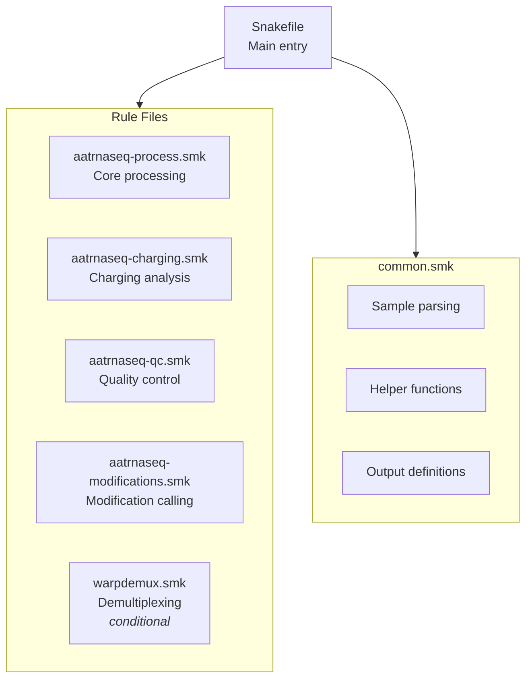
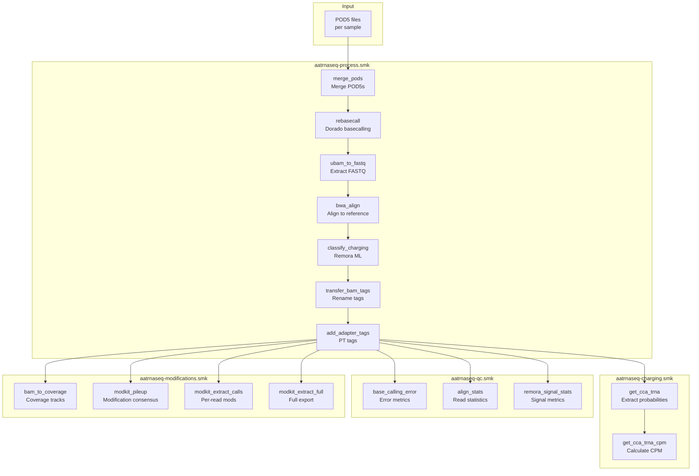
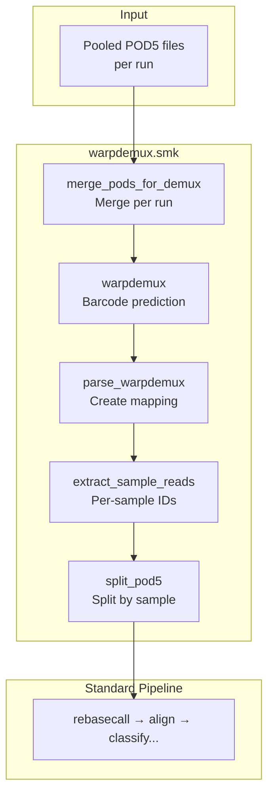

# Workflow Overview

This page provides a high-level view of the aa-tRNA-seq pipeline architecture and data flow.

## Pipeline Architecture

The pipeline is organized into modular Snakemake rule files:



## Complete Pipeline Flow

### Standard Pipeline (No Demultiplexing)



### With Demultiplexing (WarpDemuX)



## Rule Categories

### Processing Rules

Core data processing from raw signal to classified reads:

| Rule | Purpose | GPU |
|------|---------|-----|
| `merge_pods` | Combine POD5 files per sample | No |
| `rebasecall` | Basecall with Dorado | Yes |
| `ubam_to_fastq` | Extract reads for alignment | No |
| `bwa_idx` | Build BWA index | No |
| `bwa_align` | Align reads to reference | No |
| `classify_charging` | ML charging classification | Yes |
| `transfer_bam_tags` | Rename ML→CL tags | No |
| `add_adapter_tags` | Add PT tags for adapter positions | No |

### Charging Analysis Rules

Extract and summarize charging classification:

| Rule | Purpose |
|------|---------|
| `get_cca_trna` | Extract per-read charging scores |
| `get_cca_trna_cpm` | Calculate CPM-normalized counts |

### Quality Control Rules

Generate QC metrics and statistics:

| Rule | Purpose |
|------|---------|
| `base_calling_error` | Per-position error frequencies |
| `align_stats` | Read counts through pipeline |
| `remora_signal_stats` | Raw signal metrics |

### Modification Rules

RNA modification calling with Modkit:

| Rule | Purpose |
|------|---------|
| `bam_to_coverage` | Generate coverage tracks |
| `modkit_pileup` | Per-site modification consensus |
| `modkit_extract_calls` | Per-read modification calls |
| `modkit_extract_full` | Comprehensive modification export |

### Demultiplexing Rules

Optional WarpDemuX barcode demultiplexing:

| Rule | Purpose |
|------|---------|
| `merge_pods_for_demux` | Merge POD5s per run |
| `warpdemux` | Run barcode prediction |
| `parse_warpdemux` | Parse predictions to mapping |
| `extract_sample_reads` | Filter reads by barcode |
| `split_pod5` | Create per-sample POD5s |

## Key Processing Steps

### 1. POD5 Merging

Individual POD5 files from a sequencing run are merged into a single file per sample:

```
run1/pod5_pass/*.pod5  ─┐
run1/pod5_fail/*.pod5  ─┼──► sample.pod5
run2/pod5/*.pod5       ─┘
```

### 2. Basecalling

Dorado re-basecalls with:

- Move tables (`--emit-moves`) required for Remora
- Modification calling (`--modified-bases pseU m5C inosine_m6A`)
- High-accuracy model (rna004_130bps_sup@v5.1.0)

### 3. Alignment

BWA MEM with RNA-optimized parameters:

- `-x ont2d` preset for ONT reads
- Position filtering (read start ≤ 25)
- Unmapped read removal

### 4. Charging Classification

Remora ML model analyzes signal at CCA 3' end:

- Input: POD5 (signal) + BAM (alignment)
- Output: ML tag (0-255 score)
- Threshold: ≥200 = charged

!!! info "Remora Classification Details"

    A few notes about Remora classification for charged vs. uncharged tRNA reads:

    1. This step retains only full-length tRNA reads (with an allowance for signal loss at the 5' end of nanopore direct RNA sequencing)

    2. The current approach does not rely on differences in adapter sequences attached to charged vs. uncharged tRNA molecules (though these sequences are retained as separate entries in the alignment reference). The pipeline relies exclusively on signal data over a **6-nucleotide modification kmer** spanning the universal CCA 3' end of tRNA and the first three nucleotides of the 3' adapter (**CCAGGC**) to distinguish charged and uncharged reads.

### 5. Tag Transfer

Original Remora tags are renamed to avoid conflicts:

- `ML` → `CL` (charging likelihood)
- `MM` → `CM` (charging metadata)

### 6. Adapter Position Tagging

The `add_adapter_tags` rule adds PT tags with adapter boundaries:

- Uses parasail Smith-Waterman alignment
- Detects 5' and 3' adapter positions
- Can infer 5' adapter from alignment position when truncated

## Resource Requirements

### GPU Rules

These rules require GPU access:

| Rule | Typical Runtime | Memory |
|------|-----------------|--------|
| `rebasecall` | 30-60 min/sample | 24 GB |
| `classify_charging` | 10-30 min/sample | 24 GB |

### CPU-Intensive Rules

| Rule | Threads | Memory |
|------|---------|--------|
| `merge_pods` | 12 | 16 GB |
| `bwa_align` | 12 | 24 GB |
| `modkit_extract_full` | 12 | 48 GB |

### Memory-Intensive Rules

| Rule | Memory |
|------|--------|
| `modkit_extract_calls` | 96 GB |
| `warpdemux` | 32 GB |
| `remora_signal_stats` | 24 GB |

## Configuration Points

Key parameters that affect pipeline behavior:

| Parameter | Affects |
|-----------|---------|
| `opts.dorado` | Basecalling modifications |
| `opts.bwa` | Alignment sensitivity |
| `opts.bam_filter` | Full-length read filtering |
| `modkit.mod_thresholds` | Modification calling stringency |
| `warpdemux.barcode_kit` | Demultiplexing model |

## Next Steps

- [Rules Reference](rules-reference.md) - Detailed rule documentation
- [Scripts Reference](scripts-reference.md) - Python scripts documentation
- [Demultiplexing](demultiplexing.md) - WarpDemuX setup guide
