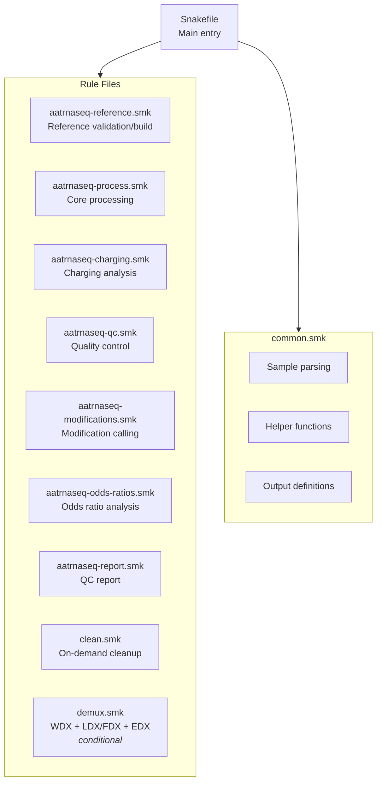
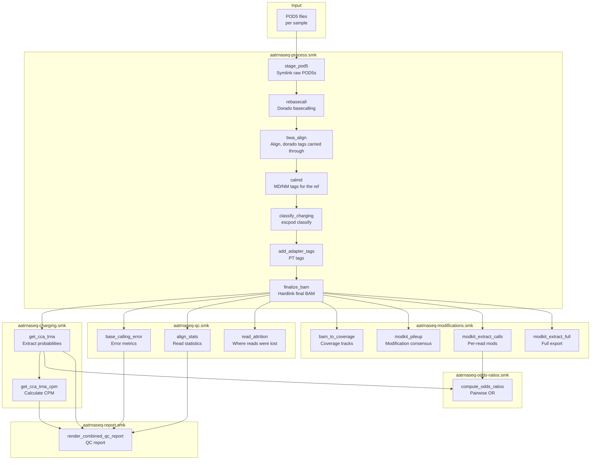
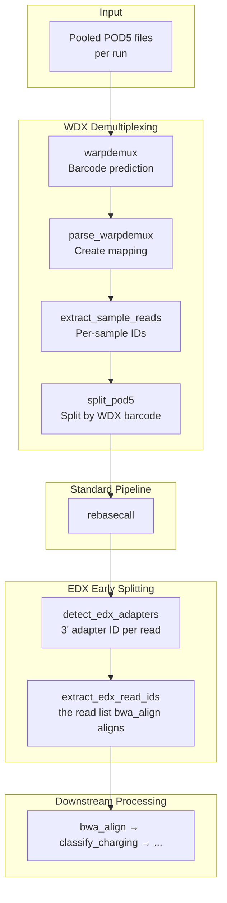
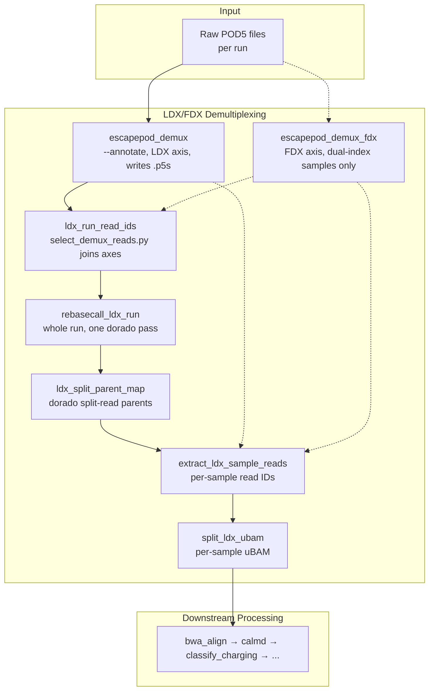

# Workflow Overview

This page provides a high-level view of the aa-tRNA-seq pipeline architecture and data flow.

## Pipeline Architecture

The pipeline is organized into modular Snakemake rule files:



## Complete Pipeline Flow

### Standard Pipeline (No Demultiplexing)



### With Demultiplexing (WarpDemuX + EDX)



### With Demultiplexing (escapepod LDX/FDX)

The escapepod backend writes no split POD5: a per-read `.p5s` sidecar records
each read's barcode call, the run is basecalled once as a whole, and the
per-sample uBAM is cut from that afterwards — rejoining the standard pipeline
at `bwa_align`.



## Rule Categories

### Processing Rules

Core data processing from raw signal to classified reads:

| Rule | Purpose | GPU |
|------|---------|-----|
| `stage_pod5` | Symlink a sample's raw POD5 files into one directory | No |
| `download_mod_models` | Pre-download dorado modification models (local rule) | No |
| `rebasecall` | Basecall with Dorado | Yes |
| `bwa_idx` | Build BWA index | No |
| `bwa_align` | Align reads to reference, carrying dorado's tags through | No |
| `calmd` | Recompute `MD`/`NM` tags against the reference | No |
| `classify_charging` | ML charging classification (`escpod classify`) | Opt-in (`charging.gpu`) |
| `add_adapter_tags` | Add PT tags for adapter positions | No |
| `finalize_bam` | Hardlink adapter-tagged BAM as the final BAM | No |

### Charging Analysis Rules

Extract and summarize charging classification:

| Rule | Purpose |
|------|---------|
| `get_cca_trna` | Extract per-read charging scores |
| `get_cca_trna_cpm` | Calculate CPM-normalized counts |

### Quality Control Rules

Generate QC metrics and statistics:

| Rule | Purpose |
|------|---------|
| `compute_reference_similarity` | Pairwise reference sequence similarity matrix |
| `base_calling_error` | Per-position error frequencies |
| `bcerror_sites` | Select sites for base-calling error reporting |
| `mismatch_calls` | Per-read mismatch calls at selected sites |
| `align_stats` | Read counts through pipeline |
| `anchor_coverage` | How many aligned reads span the CCA anchor |
| `read_attrition` | Where the run's reads were lost, as one table |

### Modification Rules

RNA modification calling with Modkit:

| Rule | Purpose |
|------|---------|
| `bam_to_coverage` | Generate coverage tracks |
| `modkit_pileup` | Per-site modification consensus |
| `modkit_extract_calls` | Per-read modification calls |
| `modkit_extract_full` | Comprehensive modification export |

### Odds Ratio Rules

Per-tRNA pairwise modification odds ratios:

| Rule | Purpose |
|------|---------|
| `compute_odds_ratios` | Pairwise modification odds ratios per tRNA |
| `filter_odds_ratios` | Filter odds-ratio table to significant/well-supported pairs |

### Report Rules

QC report generation:

| Rule | Purpose |
|------|---------|
| `render_combined_qc_report` | Combined Quarto QC report with per-sample tabs |

### Reference Rules

Validate, build, or trim the alignment reference (`aatrnaseq-reference.smk`):

| Rule | Purpose |
|------|---------|
| `validate_reference` | Check an existing reference's adapter structure (`reference.mode: validate`) |
| `build_reference` | Build an adapted reference from raw tRNA sequences (`reference.mode: build`) |
| `skip_reference_validation` | Copy the reference through unchecked (`reference.mode: skip`) |
| `trim_reference` | Strip adapters back off, for tools that want tRNA-only coordinates |

### Demultiplexing Rules

Loaded from `demux.smk` when either backend is enabled (`warpdemux.enabled` or
`ldx.enabled`); a `ruleorder` picks the active backend's version of the outputs
they share. See [Demultiplexing](demultiplexing.md) for the full flow.

**WarpDemuX (WDX), signal-based:**

| Rule | Purpose |
|------|---------|
| `warpdemux` | Run WDX barcode prediction |
| `parse_warpdemux` | Parse predictions to mapping |
| `extract_sample_reads` | Filter reads by WDX barcode |
| `split_pod5` | Create per-sample WDX POD5s |

**escapepod (LDX/FDX), basecall-based:**

| Rule | Purpose |
|------|---------|
| `escapepod_demux` | LDX axis: `escpod demux --annotate`, writes a `.p5s` sidecar per POD5 |
| `escapepod_demux_fdx` | FDX axis (5' index), dual-index samples only |
| `ldx_run_read_ids` | Reads any run sample was assigned, across axes (bounds dorado's `-l`) |
| `rebasecall_ldx_run` | Basecall the whole run in one dorado pass |
| `ldx_split_parent_map` | Map dorado split-read children back to their parent read |
| `extract_ldx_sample_reads` | Per-sample read IDs where every named axis agrees |
| `split_ldx_ubam` | Cut one sample's uBAM out of the run-level basecall |

**EDX (3' adapter), either backend:**

| Rule | Purpose |
|------|---------|
| `detect_edx_adapters` | Detect 3' adapter identity per read |
| `extract_edx_read_ids` | Extract matching read IDs for EDX (`bwa_align` aligns only these) |
| `edx_concordance` | WDX/LDX vs EDX concordance table |

### Maintenance Rules

| Rule | Purpose |
|------|---------|
| `clean` | On-demand deletion of regenerable intermediates for a completed run, by tier (see `config/README.md`) |

## Key Processing Steps

### 1. POD5 Staging

`stage_pod5` lays a directory of symlinks over a sample's raw POD5 files —
nothing is copied. Both consumers of a sample's signal (dorado, `escpod
classify`) take a directory and read it recursively, so a sample pooled from
several runs, or a run that keeps `pod5_pass`/`pod5_fail` apart, is covered
without merging:

```
run1/pod5_pass/*.pod5  ─┐
run1/pod5_fail/*.pod5  ─┼──► pod5/{sample}/<run>/<pod5_pass|pod5_fail|pod5>/*.pod5 (symlinks)
run2/pod5/*.pod5       ─┘
```

On the LDX path there is no per-sample staging step at all: `rebasecall_ldx_run`
basecalls the raw run directly, and the per-sample uBAM is cut out afterwards.

### 2. Basecalling

Dorado re-basecalls with:

- Move tables (`--emit-moves`) required by the charging model
- Modification calling (`--modified-bases pseU m5C inosine_m6A`)
- High-accuracy model (rna004_sup@v6.0.0)

### 3. Alignment

`samtools fastq -T '*'` streams the uBAM into `bwa mem -C` so dorado's tags
(move table, MM/ML modbase calls, RG) ride the FASTQ comment onto the aligned
records — no FASTQ file is written. BWA MEM runs with RNA-optimized parameters:

- `-x ont2d` preset for ONT reads
- `-K 100000000` pins the input batch regardless of thread count, since the
  tag-bearing comment is ~13x the read
- `-F 2324`: unmapped, reverse-strand, secondary and supplementary records
  removed, leaving primary forward alignments only

### 4. MD/NM Recomputation

`calmd` recomputes `MD`/`NM` against the reference (`bwa mem` does not emit
`MD` on its own). This runs as its own pass right after alignment.

### 5. Charging Classification

`escpod classify` analyzes signal at the CCA 3' end:

- Input: POD5 (signal) + aligned BAM (with move tables) + reference + model bundle
- Output: the same BAM records with a `cl` tag (0-255 score) added
- Threshold: ≥200 = charged (the bundle's own recommended operating point)

!!! warning "Reads with no `cl` tag are no-calls, not uncharged"

    The model abstains on reads whose common arm did not align, emitting no tag
    rather than a default class. Abstention is charging-correlated, so a
    charging fraction over called reads alone is an **underestimate** — the
    per-read reasons are in `{sample}.charging_calls.tsv.gz` and the run-level
    rate in `read_attrition.tsv.gz`.

!!! info "Charging Classification Details"

    A few notes about charging classification for charged vs. uncharged tRNA reads:

    1. This step retains only full-length tRNA reads (with an allowance for signal loss at the 5' end of nanopore direct RNA sequencing)

    2. The current approach does not rely on differences in adapter sequences attached to charged vs. uncharged tRNA molecules (though these sequences are retained as separate entries in the alignment reference). The pipeline relies exclusively on signal data over a **6-nucleotide modification kmer** spanning the universal CCA 3' end of tRNA and the first three nucleotides of the 3' adapter (**CCAGGC**) to distinguish charged and uncharged reads.

### 6. Adapter Position Tagging

The `add_adapter_tags` rule adds PT tags with adapter boundaries:

- Uses parasail Smith-Waterman alignment
- Detects 5' and 3' adapter positions
- Can infer 5' adapter from alignment position when truncated

## Resource Requirements

### GPU Rules

These rules always request a GPU; `classify_charging` optionally does (see
[GPU Configuration](../cluster/gpu-configuration.md)):

| Rule | Typical Runtime | Memory |
|------|-----------------|--------|
| `rebasecall` | 30-60 min/sample | 24 GB |
| `rebasecall_ldx_run` | Hours, whole flowcell | 24 GB |
| `escapepod_demux` / `escapepod_demux_fdx` | Run-dependent | See `cluster/slurm/config.yaml` |
| `classify_charging` | Opt-in via `charging.gpu` (windowed/TCN bundle only) | 24 GB |

### CPU-Intensive Rules

| Rule | Threads | Memory |
|------|---------|--------|
| `bwa_align` | 16 | 160 GB (see `cluster/slurm/config.yaml`) |
| `classify_charging` | 4 | 24 GB |
| `modkit_extract_full` | 12 | 48 GB |

### Memory-Intensive Rules

| Rule | Memory |
|------|--------|
| `modkit_extract_calls` | 96 GB |
| `warpdemux` | 32 GB |

## Configuration Points

Key parameters that affect pipeline behavior:

| Parameter | Affects |
|-----------|---------|
| `opts.dorado` | Basecalling modifications |
| `opts.bwa` | Alignment sensitivity |
| `opts.bam_filter` | Full-length read filtering |
| `modkit.mod_thresholds` | Modification calling stringency |
| `warpdemux.barcode_kit` | WDX demultiplexing model |
| `ldx.model` / `fdx.model` | escapepod LDX/FDX demultiplexing bundle |
| `charging.gpu` | Score the windowed (TCN) charging bundle on GPU instead of CPU |

## Next Steps

- [Rules Reference](rules-reference.md) - Detailed rule documentation
- [Scripts Reference](scripts-reference.md) - Python scripts documentation
- [Demultiplexing](demultiplexing.md) - WarpDemuX setup guide
