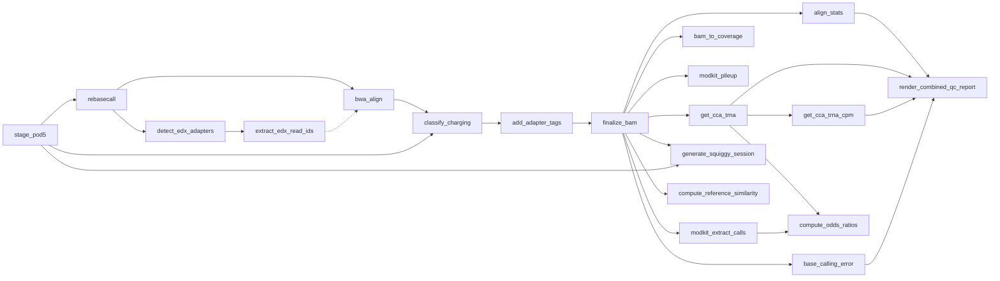

# Rules Reference

Complete documentation for all Snakemake rules in the pipeline.

## Processing Rules

These rules form the core data processing pipeline.

### stage_pod5

Lay a directory of symlinks over a sample's raw POD5 files. Nothing copies the
signal: dorado basecalls the directory with `--recursive`, and `escpod classify`
walks it, looking each aligned read up by id. This replaced `merge_pods`, which
wrote a full second copy of every run per sample.

**File:** `workflow/rules/aatrnaseq-process.smk`

| Property | Value |
|----------|-------|
| Input | All POD5 files for sample |
| Output | `pod5/{sample}/<run>/<pod5_pass\|pod5_fail\|pod5>/<file>.pod5` (symlinks) |
| GPU | No |

**Notes:**

- Links mirror the source layout so runs pooled into one sample cannot collide on a basename
- Targets are canonical paths; the directory works from anywhere
- A local rule: it is not submitted to the cluster

---

### rebasecall

Re-basecall POD5 files with Dorado, emitting move tables for the charging model.

**File:** `workflow/rules/aatrnaseq-process.smk`

| Property | Value |
|----------|-------|
| Input | Staged POD5 directory (WarpDemuX: the split POD5), mod model sentinel |
| Output | `bam/rebasecall/{sample}/{sample}.rbc.bam` |
| GPU | Yes |
| Parameters | `base_calling_model`, `opts.dorado`, `models_dir` |

**Command:**
```bash
dorado_basecall_resume.sh {output} --models-directory {models_dir} {opts.dorado} {model} {input} --recursive
```

**Notes:**

- Depends on `download_mod_models` rule to pre-download modification models
- Respects `CUDA_VISIBLE_DEVICES` environment variable
- Default options include `--modified-bases pseU m5C inosine_m6A --emit-moves`

---

### bwa_idx

Build BWA index for reference FASTA.

**File:** `workflow/rules/aatrnaseq-process.smk`

| Property | Value |
|----------|-------|
| Input | Reference FASTA |
| Output | `.amb`, `.ann`, `.bwt`, `.pac`, `.sa` files |

**Command:**
```bash
bwa index {input}
```

**Notes:**

- Only runs once per reference
- Index files are stored alongside the FASTA

---

### bwa_align

Align reads to the tRNA reference with BWA MEM, carrying dorado's tags through.
`samtools fastq -T '*'` writes every uBAM tag into the FASTQ comment and
`bwa mem -C` appends it to each aligned record, so the move table (`mv`, `ns`,
`ts`), the MM/ML modbase calls and `RG` arrive on the aligned BAM in one
streaming pass. No FASTQ is written and there is no separate tag-injection step.

**File:** `workflow/rules/aatrnaseq-process.smk`

| Property | Value |
|----------|-------|
| Input | Rebasecalled uBAM, EDX read-id list (EDX samples only), BWA index |
| Output | `bam/aln/{sample}/{sample}.aln.bam`, `.bai`, `{sample}.rg.sam` |
| Threads | 16 |
| Parameters | `fasta`, `opts.bwa` |

**Command:**
```bash
python stamp_read_groups.py {ubam} --sample {sample} [--library {run_id}] [--barcode {bc}] > {rg.sam}

samtools view -u [-N {edx_read_ids}] {ubam} \
    | samtools fastq -T '*' - \
    | awk 'NR % 4 == 1 && bc != "" { $0 = $0 "\t" bc } { print }' bc="BC:Z:{barcode}" \
    | bwa mem -C -K 100000000 -t {threads} -H {rg.sam} {opts.bwa} {index} - \
    | samtools view -u -F 2324 - \
    | samtools sort -m 2G -@ 4 -o {output}
samtools index {output}
```

**Filtering:**

- `-F 2324`: Remove unmapped (`0x4`), reverse-strand (`0x10`), secondary (`0x100`) and supplementary (`0x800`) records

**Notes:**

- `-H` inserts the uBAM's own `@RG` lines with `SM`/`LB`/`BC` stamped, so the per-read `RG:Z:` that `-C` copies through resolves to a declared read group
- On demultiplexed runs a constant `BC:Z:` is added to every read via the FASTQ comment
- `-K 100000000` pins bwa's input batch at 100 Mbases regardless of thread count. The FASTQ comment is ~13x the read (the move table dominates), and bwa holds a batch plus its output in memory; pinning keeps that at a few GB where the default per-thread batch is what PR #86 saw OOM at 48 GB

**Default BWA options:**

- `-W 13 -k 6 -T 20 -x ont2d` (RNA-optimized)

---

### classify_charging

Classify charged vs uncharged reads with `escpod classify`.

**File:** `workflow/rules/aatrnaseq-process.smk`

| Property | Value |
|----------|-------|
| Input | POD5 store (staged directory, split POD5, or raw LDX run), aligned BAM, reference FASTA |
| Output | `bam/charging/{sample}/{sample}.charging.bam`, `.bai`, `summary/tables/{sample}/{sample}.charging_calls.tsv.gz` |
| Threads | 8 |
| GPU | No (CPU) |
| Parameters | `charging.model`, `charging.min_mapq` |

**Command:**
```bash
escpod classify {pod5} \
    --bam {bam} \
    --reference {reference} \
    --model {model} \
    --output {output} \
    --tsv {calls} \
    --min-mapq {min_mapq} \
    --threads {threads}
samtools index {output}
```

**Output tags:**

- `cl`: `round(P(charged) * 255)`, on every record the model scored; unscored records pass through untouched and are listed with a `reason` in the calls TSV

**Notes:**

- The POD5 argument is the sample's whole signal store, never a subset: classify looks each aligned read up by id, so reads the BAM does not name are never touched

---

### add_adapter_tags

Detect adapter positions using parasail alignment and add PT tags to create final BAM.

**File:** `workflow/rules/aatrnaseq-process.smk`

| Property | Value |
|----------|-------|
| Input | Classified BAM |
| Output | `bam/adapter_tagged/{sample}/{sample}.bam`, `.bai` |
| Parameters | `adapters.*` config options |

**Command:**
```bash
python add_adapter_tags.py \
    -i {classified_bam} \
    -o {output} \
    --adapter-5p "{adapter_5p}" \
    --adapter-3p "{adapter_3p}" \
    --min-score-5p {min_score_5p} \
    --min-score-3p {min_score_3p}
samtools index {output}
```

**PT tag format:**
```
PT:Z:start;end;strand;type|start;end;strand;type
Example: PT:Z:0;24;+;5p_adapter|118;135;+;3p_adapter
```

**Notes:**

- Uses parasail Smith-Waterman alignment to find adapter positions
- Can infer 5' adapter presence from alignment position when adapter is truncated
- Output goes to `bam/adapter_tagged/`; the downstream `finalize_bam` rule produces the final BAM at `bam/final/`

---

### finalize_bam

Produce the final BAM for downstream analysis. Hardlinks the adapter-tagged BAM as the final output. EDX filtering happens before alignment: `detect_edx_adapters` / `extract_edx_read_ids` produce the read list `bwa_align` aligns.

**File:** `workflow/rules/aatrnaseq-process.smk`

| Property | Value |
|----------|-------|
| Input | `bam/adapter_tagged/{sample}/{sample}.bam`, `.bai` |
| Output | `bam/final/{sample}/{sample}.bam`, `.bai` |

**Notes:**

- Hardlinks the adapter-tagged BAM (zero-copy passthrough that survives `cascade` cleanup)
- This is the final BAM with all tags: `cl` (charging), `pt` (adapters) and `BC` (barcode, demultiplexed runs only), plus dorado's MM/ML modbase tags
- The header carries a valid `@RG` whose `SM`/`LB`/`BC` are the pipeline's sample, run and barcode, with dorado's `ID` and basecall-model provenance preserved

---

## Charging Analysis Rules

### get_cca_trna

Extract charging probability (CL tag) per read to TSV.

**File:** `workflow/rules/aatrnaseq-charging.smk`

| Property | Value |
|----------|-------|
| Input | Final BAM |
| Output | `summary/tables/{sample}/{sample}.charging_prob.tsv.gz` |

**Command:**
```bash
python get_charging_table.py --tag CL {input} {output}
```

**Output columns:**

| Column | Description |
|--------|-------------|
| read_id | Nanopore read identifier |
| tRNA | Aligned reference name |
| charging_likelihood | CL tag value (0-255) |

---

### get_cca_trna_cpm

Calculate CPM-normalized charging counts per tRNA.

**File:** `workflow/rules/aatrnaseq-charging.smk`

| Property | Value |
|----------|-------|
| Input | Charging probability TSV |
| Output | `summary/tables/{sample}/{sample}.charging.cpm.tsv.gz` |
| Parameters | `ml_thresh=200` (hardcoded) |

**Command:**
```bash
python get_trna_charging_cpm.py \
    --input {charging_prob} \
    --output {output} \
    --ml-threshold 200
```

**Classification:**

- Score ≥ 200: Charged
- Score < 200: Uncharged

**Output columns:**

| Column | Description |
|--------|-------------|
| tRNA | Reference name |
| counts_charged | Charged read count |
| counts_uncharged | Uncharged read count |
| cpm_charged | Charged CPM |
| cpm_uncharged | Uncharged CPM |

---

## Quality Control Rules

### compute_reference_similarity

Compute pairwise sequence similarity matrix for the reference FASTA.

**File:** `workflow/rules/aatrnaseq-qc.smk`

| Property | Value |
|----------|-------|
| Input | Reference FASTA |
| Output | `summary/qc/reference_similarity.tsv`, `summary/qc/reference_similarity.clusters.tsv` |
| Threads | 4 |
| GPU | No |

**Command:**
```bash
python compute_seq_similarity.py {fasta} {output} \
    --threads {threads} --max-mismatch {max_mismatch} --clusters {clusters}
```

Identical sequences are collapsed before aligning (lossless). Gated by
`qc.reference_similarity` and skipped above `qc.reference_similarity_max_seqs`;
`qc.reference_similarity_max_mismatch` additionally collapses near-identical
sequences by Hamming distance.

**Notes:**

- Uses Needleman-Wunsch global alignment to compute all-vs-all pairwise similarity
- Percent identity = matches / max(len_seq1, len_seq2) * 100
- Identifies potential cross-mapping issues from homologous tRNA sequences

---

### base_calling_error

Extract per-position basecalling error metrics.

**File:** `workflow/rules/aatrnaseq-qc.smk`

| Property | Value |
|----------|-------|
| Input | Final BAM, reference FASTA |
| Output | `summary/tables/{sample}/{sample}.bcerror.tsv.gz` |

**Command:**
```bash
python get_bcerror_freqs.py {bam} {fasta} {output}
```

**Output columns:**

| Column | Description |
|--------|-------------|
| Position | Reference position |
| Coverage | Read coverage |
| A_Freq, T_Freq, G_Freq, C_Freq | Base frequencies |
| MismatchFreq | Mismatch rate |
| InsertionFreq | Insertion rate |
| DeletionFreq | Deletion rate |
| BCErrorFreq | Combined error rate |
| MeanQual | Mean base quality |

---

### align_stats

Summarize alignment statistics across pipeline stages.

**File:** `workflow/rules/aatrnaseq-qc.smk`

| Property | Value |
|----------|-------|
| Input | Unmapped BAM, aligned BAM, classified BAM |
| Output | `summary/tables/{sample}/{sample}.align_stats.tsv.gz` |

**Command:**
```bash
python get_align_stats.py \
    -o {output} \
    -a unmapped aligned classified \
    -i {sample} \
    -b {unmapped} {aligned} {classified}
```

**Output columns:**

| Column | Description |
|--------|-------------|
| bam_file | Source BAM path |
| id | Sample identifier |
| info | Pipeline stage |
| n_reads | Total reads |
| pct_mapped | Percent mapped |
| mean_length | Mean read length |
| mean_bq | Mean base quality |
| mean_mapq | Mean mapping quality |

---

### read_attrition

Report where the run's reads were lost, as one table.

**File:** `workflow/rules/aatrnaseq-qc.smk`

| Property | Value |
|----------|-------|
| Input | Per-sample align stats, anchor coverage, charging calls, demux summaries |
| Output | `summary/read_attrition.tsv.gz` |

**Command:**
```bash
python read_attrition.py \
    --align-stats {align_stats} \
    --anchor-coverage {anchor} \
    --charging-calls {charging_calls} \
    --output {output}
```

**Notes:**

- Always produced
- The `aligned -> charge-called` gate is broken out by the model's own
  `reason` column, so the loss is named rather than inferred

---

## Modification Rules

### bam_to_coverage

Generate BedGraph coverage tracks.

**File:** `workflow/rules/aatrnaseq-modifications.smk`

| Property | Value |
|----------|-------|
| Input | Final BAM |
| Output | `summary/tables/{sample}/{sample}.{cpm,counts}.bg.gz` (protected) |
| Threads | 4 |
| Parameters | `opts.coverage` |

**Command:**
```bash
bamCoverage -b {bam} -o {cpm} --normalizeUsing CPM -bs 1 {opts}
bamCoverage -b {bam} -o {counts} -bs 1 {opts}
gzip {outputs}
```

---

### modkit_pileup

Generate per-site modification consensus.

**File:** `workflow/rules/aatrnaseq-modifications.smk`

| Property | Value |
|----------|-------|
| Input | Final BAM |
| Output | `summary/modkit/{sample}/{sample}.pileup.bed.gz` |
| Parameters | `fasta`, modkit thresholds |

**Command:**
```bash
modkit pileup --ref {fasta} {threshold_opts} {bam} - | gzip > {output}
```

---

### modkit_extract_calls

Extract per-read modification calls.

**File:** `workflow/rules/aatrnaseq-modifications.smk`

| Property | Value |
|----------|-------|
| Input | Final BAM |
| Output | `summary/modkit/{sample}/{sample}.mod_calls.tsv.gz` |
| Memory | 96 GB |
| Parameters | `fasta`, modkit thresholds |

**Command:**
```bash
modkit extract calls \
    --bgzf \
    --reference {fasta} \
    --edge-filter 10 \
    --mapped --pass \
    {threshold_opts} \
    {bam} {output}
```

---

### modkit_extract_full

Export comprehensive modification information.

**File:** `workflow/rules/aatrnaseq-modifications.smk`

| Property | Value |
|----------|-------|
| Input | Final BAM |
| Output | `summary/modkit/{sample}/{sample}.mod_full.tsv.gz` |
| Threads | 12 |
| Memory | 48 GB |

**Command:**
```bash
modkit extract full \
    --bgzf \
    --threads 12 \
    --reference {fasta} \
    --edge-filter 10 \
    --mapped \
    {threshold_opts} \
    {bam} {output}
```

---

## Utility Rules

### generate_squiggy_session

Generate a Squiggy session JSON file for loading pipeline outputs in Positron IDE.

**File:** `workflow/rules/common.smk`

| Property | Value |
|----------|-------|
| Input | All final BAMs, all merged POD5s, reference FASTA |
| Output | `squiggy-session.json` (at output root) |
| GPU | No |

**Command:**
```bash
python generate_squiggy_session.py \
    --samples {sample_names} \
    --output-dir {output_dir} \
    --fasta {fasta} \
    --output {output.session}
```

**Notes:**

- Generates absolute paths to POD5, BAM, and FASTA files for each sample
- Computes MD5 checksums for file integrity verification
- Includes default plot options for the Squiggy viewer (eventalign mode, z-normalization)

---

## Odds Ratio Rules

### compute_odds_ratios

Compute per-tRNA pairwise modification odds ratios.

**File:** `workflow/rules/aatrnaseq-odds-ratios.smk`

| Property | Value |
|----------|-------|
| Input | Modkit extract calls TSV, charging probability TSV |
| Output | `summary/tables/{sample}/{sample}.odds_ratios.tsv.gz` |
| Parameters | `odds_ratios.ml_threshold` (default: 200), `odds_ratios.min_coverage` (default: 10) |

**Command:**
```bash
python compute_odds_ratios.py \
    --modkit {modkit_calls} \
    --charging {charging_prob} \
    --output {output} \
    --ml-threshold {ml_thresh} \
    --min-coverage {min_cov}
```

**Notes:**

- For each tRNA, tests whether modification at position X is correlated with modification at position Y (and with charging status) via 2x2 contingency tables
- Uses Haldane correction for zero cells and Fisher's exact test
- Applies BH correction across all results
- Charging status is represented as position 999

**Output columns:**

| Column | Description |
|--------|-------------|
| `tRNA` | Reference tRNA name |
| `pos1` | First position |
| `pos2` | Second position (999 = charging) |
| `n00`, `n01`, `n10`, `n11` | Contingency table counts |
| `total_obs` | Total observations |
| `odds_ratio` | Odds ratio |
| `log_odds_ratio` | Log odds ratio |
| `se_log_or` | Standard error of log OR |
| `ci_lower`, `ci_upper` | 95% confidence interval |
| `fisher_or` | Fisher's exact test OR |
| `p_value` | Fisher's exact test p-value |
| `p_adjusted` | BH-adjusted p-value |

---

## Report Rules

### render_combined_qc_report

Render a combined Quarto QC report with per-sample tabs.

**File:** `workflow/rules/aatrnaseq-report.smk`

| Property | Value |
|----------|-------|
| Input | Alignment stats, charging probabilities, charging CPM, basecalling errors (all samples) |
| Output | `reports/qc_report.html` |
| Parameters | `ml-threshold`, `report.custom_include` |

**Command:**
```bash
quarto render qc-report.qmd \
    -P config_file:{config} \
    -P ml_threshold:{threshold} \
    --output-dir {output_dir}
```

**Notes:**

- Requires the `report` pixi environment: `pixi run -e report snakemake render_combined_qc_report`
- Generates faceted QC plots with per-sample patchwork tabs
- Supports optional custom Quarto include via `report.custom_include` config

---

## Demultiplexing Rules

See [Demultiplexing](demultiplexing.md) for detailed documentation.

### warpdemux

Run WarpDemuX barcode prediction.

| Output | `demux/warpdemux_output/{run_id}/` |

### parse_warpdemux

Parse predictions to barcode mapping file.

| Output | `demux/read_ids/{run_id}/barcode_mapping.tsv.gz` |

### extract_sample_reads

Filter read IDs for specific sample's barcode.

| Output | `demux/read_ids/{sample}.txt` |

### split_pod5

Split merged POD5 by sample using read ID list.

| Output | `demux/pod5/{sample}.pod5` |

### detect_edx_adapters

Detect 3' adapter identity per read on unaligned BAM (before alignment). Only runs for EDX samples.

| Output | `demux/edx/{sample}/{sample}.edx_adapters.tsv.gz` |

### extract_edx_read_ids

Extract read IDs matching the sample's EDX adapter assignment.

| Output | `demux/edx/{sample}/{sample}.edx_read_ids.txt` |

### edx_concordance

Build concordance table of WDX vs EDX adapter identity from adapter detection TSVs.

| Output | `summary/edx/edx_concordance.tsv.gz` |

---

## Rule Dependencies



**Note:** Dashed lines (-.->`) indicate conditional paths. For EDX samples, `extract_edx_read_ids` bounds what `bwa_align` aligns; every other sample aligns its whole uBAM.
