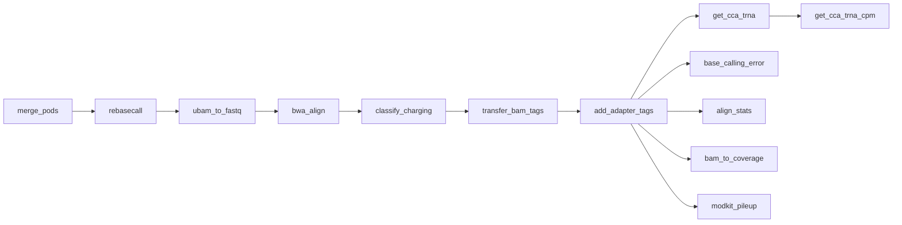

# Rules Reference

Complete documentation for all Snakemake rules in the pipeline.

## Processing Rules

These rules form the core data processing pipeline.

### merge_pods

Merge all POD5 files for a sample into a single file.

**File:** `workflow/rules/aatrnaseq-process.smk`

| Property | Value |
|----------|-------|
| Input | All POD5 files for sample |
| Output | `pod5/{sample}/{sample}.pod5` |
| Threads | 12 |
| GPU | No |

**Command:**
```bash
pod5 merge -t {threads} -f -o {output} {input}
```

---

### rebasecall

Re-basecall POD5 files with Dorado, emitting move tables for Remora.

**File:** `workflow/rules/aatrnaseq-process.smk`

| Property | Value |
|----------|-------|
| Input | Merged POD5 |
| Output | `bam/rebasecall/{sample}/{sample}.rbc.bam` (protected) |
| GPU | Yes |
| Parameters | `base_calling_model`, `opts.dorado` |

**Command:**
```bash
dorado basecaller {opts.dorado} {model} {input} > {output}
```

**Notes:**

- Output is protected (not deleted on pipeline restart)
- Respects `CUDA_VISIBLE_DEVICES` environment variable
- Default options include `--modified-bases pseU m5C inosine_m6A --emit-moves`

---

### ubam_to_fastq

Extract reads from unmapped BAM to FASTQ format.

**File:** `workflow/rules/aatrnaseq-process.smk`

| Property | Value |
|----------|-------|
| Input | Rebasecalled BAM |
| Output | `fq/{sample}/{sample}.fq.gz` |

**Command:**
```bash
samtools fastq -T "*" {input} | gzip > {output}
```

---

### bwa_idx

Build BWA index for reference FASTA.

**File:** `workflow/rules/aatrnaseq-process.smk`

| Property | Value |
|----------|-------|
| Input | Reference FASTA |
| Output | `.amb`, `.ann`, `.bwt`, `.pac`, `.sa` files |

**Command:**
```bash
bwa index {input}
```

**Notes:**

- Only runs once per reference
- Index files are stored alongside the FASTA

---

### bwa_align

Align reads to tRNA reference with BWA MEM.

**File:** `workflow/rules/aatrnaseq-process.smk`

| Property | Value |
|----------|-------|
| Input | FASTQ, BWA index |
| Output | `bam/aln/{sample}/{sample}.aln.bam`, `.bai` |
| Threads | 12 |
| Parameters | `fasta`, `opts.bwa` |

**Command:**
```bash
bwa mem -C -t {threads} {opts.bwa} {index} {reads} \
    | samtools view -F 4 -h \
    | awk '($1 ~ /^@/ || $4 <= 25)' \
    | samtools view -Sb - \
    | samtools sort -o {output}
samtools index {output}
```

**Filtering:**

- `-F 4`: Remove unmapped reads
- `$4 <= 25`: Keep reads with start position ≤ 25

**Default BWA options:**

- `-W 13 -k 6 -T 20 -x ont2d` (RNA-optimized)

---

### classify_charging

Run Remora ML model to classify charged vs uncharged reads.

**File:** `workflow/rules/aatrnaseq-process.smk`

| Property | Value |
|----------|-------|
| Input | POD5, aligned BAM |
| Output | `bam/charging/{sample}/{sample}.charging.bam`, `.bai` |
| GPU | Yes |
| Parameters | `remora_cca_classifier` |

**Command:**
```bash
remora infer from_pod5_and_bam {pod5} {bam} \
    --model {model} \
    --out-bam {output} \
    --reference-anchored \
    --device 0
samtools sort {output} > {temp}
samtools index {output}
```

**Output tags:**

- `ML`: Modification likelihood (0-255)
- `MM`: Modification metadata

---

### transfer_bam_tags

Transfer and rename charging tags from Remora output to classified BAM.

**File:** `workflow/rules/aatrnaseq-process.smk`

| Property | Value |
|----------|-------|
| Input | Charging BAM, aligned BAM |
| Output | `bam/classified/{sample}/{sample}.bam`, `.bai` |

**Command:**
```bash
python transfer_tags.py \
    --tags ML MM \
    --rename ML=CL MM=CM \
    --source {charging_bam} \
    --target {aligned_bam} \
    --output {output}
samtools index {output}
```

**Tag renaming:**

- `ML` → `CL`: Charging likelihood
- `MM` → `CM`: Charging metadata

This prevents interference with standard SAM modification tags.

---

### add_adapter_tags

Detect adapter positions using parasail alignment and add PT tags to create final BAM.

**File:** `workflow/rules/aatrnaseq-process.smk`

| Property | Value |
|----------|-------|
| Input | Classified BAM |
| Output | `bam/final/{sample}/{sample}.bam`, `.bai` |
| Parameters | `adapters.*` config options |

**Command:**
```bash
python add_adapter_tags.py \
    -i {classified_bam} \
    -o {output} \
    --adapter-5p "{adapter_5p}" \
    --adapter-3p "{adapter_3p}" \
    --min-score-5p {min_score_5p} \
    --min-score-3p {min_score_3p}
samtools index {output}
```

**PT tag format:**
```
PT:Z:start;end;strand;type|start;end;strand;type
Example: PT:Z:0;24;+;5p_adapter|118;135;+;3p_adapter
```

**Notes:**

- Uses parasail Smith-Waterman alignment to find adapter positions
- Can infer 5' adapter presence from alignment position when adapter is truncated
- This is the final BAM with all tags: CL/CM (charging) and PT (adapters)

---

## Charging Analysis Rules

### get_cca_trna

Extract charging probability (CL tag) per read to TSV.

**File:** `workflow/rules/aatrnaseq-charging.smk`

| Property | Value |
|----------|-------|
| Input | Final BAM |
| Output | `summary/tables/{sample}/{sample}.charging_prob.tsv.gz` |

**Command:**
```bash
python get_charging_table.py --tag CL {input} {output}
```

**Output columns:**

| Column | Description |
|--------|-------------|
| read_id | Nanopore read identifier |
| tRNA | Aligned reference name |
| charging_likelihood | CL tag value (0-255) |

---

### get_cca_trna_cpm

Calculate CPM-normalized charging counts per tRNA.

**File:** `workflow/rules/aatrnaseq-charging.smk`

| Property | Value |
|----------|-------|
| Input | Charging probability TSV |
| Output | `summary/tables/{sample}/{sample}.charging.cpm.tsv.gz` |
| Parameters | `ml_thresh=200` (hardcoded) |

**Command:**
```bash
python get_trna_charging_cpm.py \
    --input {charging_prob} \
    --output {output} \
    --ml-threshold 200
```

**Classification:**

- Score ≥ 200: Charged
- Score < 200: Uncharged

**Output columns:**

| Column | Description |
|--------|-------------|
| tRNA | Reference name |
| counts_charged | Charged read count |
| counts_uncharged | Uncharged read count |
| cpm_charged | Charged CPM |
| cpm_uncharged | Uncharged CPM |

---

## Quality Control Rules

### base_calling_error

Extract per-position basecalling error metrics.

**File:** `workflow/rules/aatrnaseq-qc.smk`

| Property | Value |
|----------|-------|
| Input | Final BAM, reference FASTA |
| Output | `summary/tables/{sample}/{sample}.bcerror.tsv.gz` |

**Command:**
```bash
python get_bcerror_freqs.py {bam} {fasta} {output}
```

**Output columns:**

| Column | Description |
|--------|-------------|
| Position | Reference position |
| Coverage | Read coverage |
| A_Freq, T_Freq, G_Freq, C_Freq | Base frequencies |
| MismatchFreq | Mismatch rate |
| InsertionFreq | Insertion rate |
| DeletionFreq | Deletion rate |
| BCErrorFreq | Combined error rate |
| MeanQual | Mean base quality |

---

### align_stats

Summarize alignment statistics across pipeline stages.

**File:** `workflow/rules/aatrnaseq-qc.smk`

| Property | Value |
|----------|-------|
| Input | Unmapped BAM, aligned BAM, classified BAM |
| Output | `summary/tables/{sample}/{sample}.align_stats.tsv.gz` |

**Command:**
```bash
python get_align_stats.py \
    -o {output} \
    -a unmapped aligned classified \
    -i {sample} \
    -b {unmapped} {aligned} {classified}
```

**Output columns:**

| Column | Description |
|--------|-------------|
| bam_file | Source BAM path |
| id | Sample identifier |
| info | Pipeline stage |
| n_reads | Total reads |
| pct_mapped | Percent mapped |
| mean_length | Mean read length |
| mean_bq | Mean base quality |
| mean_mapq | Mean mapping quality |

---

### remora_signal_stats

Extract raw signal metrics using Remora API.

**File:** `workflow/rules/aatrnaseq-qc.smk`

| Property | Value |
|----------|-------|
| Input | Final BAM, POD5 |
| Output | `summary/tables/{sample}/{sample}.remora.tsv.gz` |
| Parameters | `remora_kmer_table`, `opts.remora` |

**Command:**
```bash
python extract_signal_metrics.py \
    --pod5_dir {pod5} \
    --bam {bam} \
    --kmer {kmer_table} \
    --sample_name {sample} \
    | gzip > {output}
```

**Notes:**

- Only runs if `remora_kmer_table` is configured
- Uses custom Remora fork for metrics extraction

---

## Modification Rules

### bam_to_coverage

Generate BedGraph coverage tracks.

**File:** `workflow/rules/aatrnaseq-modifications.smk`

| Property | Value |
|----------|-------|
| Input | Final BAM |
| Output | `summary/tables/{sample}/{sample}.{cpm,counts}.bg.gz` (protected) |
| Threads | 4 |
| Parameters | `opts.coverage` |

**Command:**
```bash
bamCoverage -b {bam} -o {cpm} --normalizeUsing CPM -bs 1 {opts}
bamCoverage -b {bam} -o {counts} -bs 1 {opts}
gzip {outputs}
```

---

### modkit_pileup

Generate per-site modification consensus.

**File:** `workflow/rules/aatrnaseq-modifications.smk`

| Property | Value |
|----------|-------|
| Input | Final BAM |
| Output | `summary/modkit/{sample}/{sample}.pileup.bed.gz` |
| Parameters | `fasta`, modkit thresholds |

**Command:**
```bash
modkit pileup --ref {fasta} {threshold_opts} {bam} - | gzip > {output}
```

---

### modkit_extract_calls

Extract per-read modification calls.

**File:** `workflow/rules/aatrnaseq-modifications.smk`

| Property | Value |
|----------|-------|
| Input | Final BAM |
| Output | `summary/modkit/{sample}/{sample}.mod_calls.tsv.gz` |
| Memory | 96 GB |
| Parameters | `fasta`, modkit thresholds |

**Command:**
```bash
modkit extract calls \
    --bgzf \
    --reference {fasta} \
    --edge-filter 10 \
    --mapped --pass \
    {threshold_opts} \
    {bam} {output}
```

---

### modkit_extract_full

Export comprehensive modification information.

**File:** `workflow/rules/aatrnaseq-modifications.smk`

| Property | Value |
|----------|-------|
| Input | Final BAM |
| Output | `summary/modkit/{sample}/{sample}.mod_full.tsv.gz` |
| Threads | 12 |
| Memory | 48 GB |

**Command:**
```bash
modkit extract full \
    --bgzf \
    --threads 12 \
    --reference {fasta} \
    --edge-filter 10 \
    --mapped \
    {threshold_opts} \
    {bam} {output}
```

---

## Demultiplexing Rules

See [Demultiplexing](demultiplexing.md) for detailed documentation.

### warpdemux

Run WarpDemuX barcode prediction.

| Output | `demux/warpdemux_output/{run_id}/` |

### parse_warpdemux

Parse predictions to barcode mapping file.

| Output | `demux/read_ids/{run_id}/barcode_mapping.tsv.gz` |

### extract_sample_reads

Filter read IDs for specific sample's barcode.

| Output | `demux/read_ids/{sample}.txt` |

### split_pod5

Split merged POD5 by sample using read ID list.

| Output | `demux/pod5/{sample}.pod5` |

---

## Rule Dependencies


